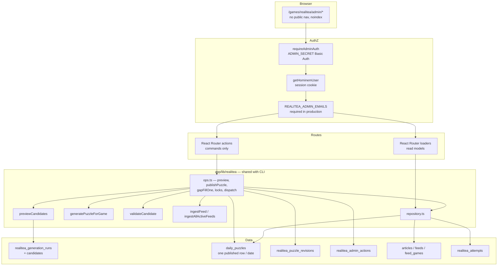
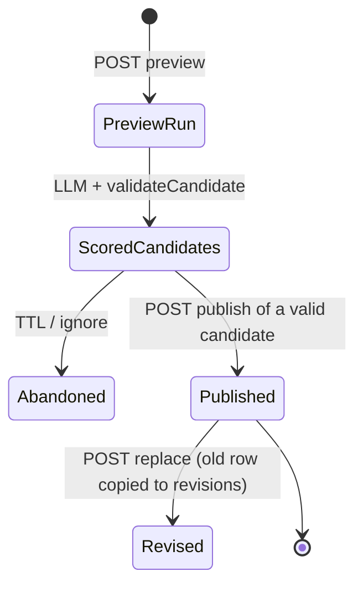
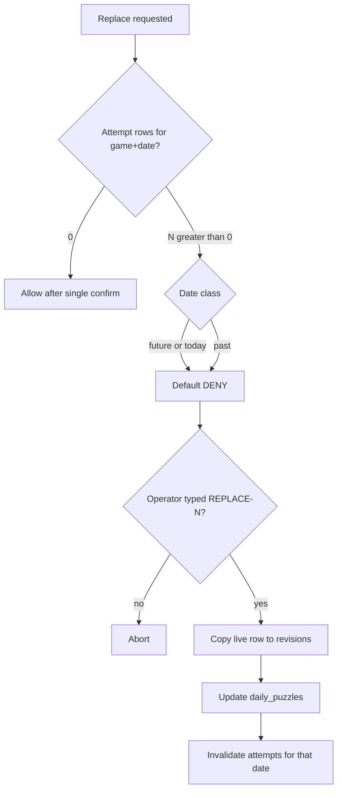

# RealiTea Production Admin: Try Generations and Operate Daily Puzzles

| Field | Value |
| --- | --- |
| Status | Draft (rev 5 — user decisions: block future dates, restore v1.5, no new feeds, PAT dispatch) |
| Date | 2026-08-12 |
| Author | TBD |
| Audience | Senior engineers familiar with this repo |
| Repo | `/Users/charlesponti/Developer/labs` |
| Related | `docs/realitea/game-schema-expansion.md`, `docs/realitea/prompt-evaluation.md`. `docs/realitea/architecture.md` is **historical** (still names `realitea:gen` / `realitea.reconcile.ts`); treat `generation.ts`, `repository.ts`, `scripts/realitea-generate.ts`, and `.github/workflows/realitea-generate.yml` as source of truth. |

---

## Overview

RealiTea currently publishes a five-letter daily puzzle by writing a row to `labs.daily_puzzles` and serving it immediately. There is no draft, no promotion, no revision history, and no operator UI. The only production write path is `scripts/realitea-generate.ts` (gap-fill on cron; `--force` deletes all future inventory and regenerates). The only production read path for operators is `GET /api/games/realitea/health`, gated by shared-secret Basic Auth, and it deliberately omits the answer.

This document designs a **production operator console** so an admin can (1) try new generations in production without replacing the live puzzle, and (2) inspect and carefully replace a particular day's game. The console reuses the existing domain functions (`previewCandidates`, `validateCandidate`, `generatePuzzleForGame`, ingest, repository queries). It does **not** fork generation into route-local prompt code, and it does **not** implement the full multi-profile schema expansion.

The safety valve is a new **run / candidate / publish** model: LLM output lands in `realitea_generation_runs` + `realitea_generation_candidates`. `daily_puzzles` remains the single published row per `(game_id, date_utc)`. Publish is an explicit, audited command with attempt-aware guardrails. Preview never calls `deletePuzzlesFromDate`.

HTTP actions are budgeted at **one LLM completion** (preview) or **one date write with `maxAttempts: 1`**. Multi-day gap-fill / scoped regenerate is **not** a request-scoped loop: the console dispatches `realitea-generate.yml` **only after** that workflow accepts `mode` / `from` / `to` (today’s YAML always `--force`s on `workflow_dispatch`). `generation_run_id` on a published row is `onDelete: "set null"` so a 30-day run TTL cannot delete live puzzles.

---

## Background & Motivation

### Current state

| Concern | Reality today |
| --- | --- |
| Publishing | `generatePuzzleForGame` inserts into `daily_puzzles` as soon as the first valid candidate wins (`app/lib/realitea/generation.ts`). |
| Serving | `loadPuzzleForDate` / `resolveActivePuzzle` serve that row directly (`app/lib/realitea/repository.ts`, `puzzle.server.ts`). Comment in repository: *“There is no promotion or status lifecycle.”* |
| Uniqueness | Unique index `daily_puzzles_game_date_idx` on `(game_id, date_utc)`. One live puzzle per date. The “most recently created if multiple exist” comment is dead code relative to the index. |
| Inventory | Cron `0 17 * * *` plus `workflow_dispatch --force` in `.github/workflows/realitea-generate.yml`. **Today** `--force` calls `deletePuzzlesFromDate(game.id, nextDayKey)` and therefore deletes **every** `date_utc >= tomorrow`, then only regenerates `daysAhead` (days beyond the window stay deleted/empty). This design **changes** that: force becomes range-scoped to `[tomorrow, tomorrow+daysAhead)`. |
| Preview | `previewCandidates` + `scripts/realitea-preview.ts` / `scripts/realitea-prompt-test.ts`. Bypasses article inventory; default feed is still `https://realityblurb.com/feed`. |
| Prompt / model | Game row stores `system_prompt_path`. `getSystemPromptForGame(game)` already wraps file load (`generation.ts`). Production default is `deepseek/deepseek-v4-flash` via `getConfiguredTextModel()` (`app/lib/server/ai/index.ts`). `chatCompletion` always uses that helper and **has no** `REALITEA_AI_BASE_URL` / `localChatCompletion` branch. Prompt-test still assigns `process.env.REALITEA_AI_MODEL` and unused `REALITEA_AI_BASE_URL`. |
| Player progress | `realitea_attempts` keyed by `(hominem_user_id, game_id, date_utc)`, not `puzzle_id`. Guess letter states were scored against whatever answer existed at guess time. |
| Future dates | **Today:** `/games/realitea/:date` + `loadPuzzleForSpecificDate` have **no “must be ≤ today” check**. A signed-in player who knows tomorrow’s URL can play future inventory. **This design:** required player-safety PR blocks that (date ≤ player-today). Console still counts attempts. |
| Admin auth | `requireAdminAuth` in `app/lib/server/admin-auth.ts` — Basic Auth password compared to `ADMIN_SECRET`, fails closed if unset. Used only by `app/routes/api.games.realitea.health.ts`. |
| Player auth | Hominem Better Auth via `getHominemUser()` / `buildHominemLoginUrl()`. Labs must not host a login form. |
| Schema expansion | `docs/realitea/game-schema-expansion.md` is documented, not implemented. Article `status` is still global. `articles.article_text` is in the working-tree schema (migration `0014`). If 0014 is not on `main` yet it must land via Drizzle generate+commit **before** depending on the column — do not hand-finish SQL or edit `_journal.json`. |
| Generation payload | **Working tree (adopt):** `articleToFeedItem` already sets `articleText: sanitizeFeedText(..., MAX_ARTICLE_TEXT_LENGTH)` (24_000) and `buildMessages` tells the model to prefer `articleText` over title/description. Cron and preview share this mapper. Do **not** revert it in console PRs. |
| Ingest cadence | `ingest.ts` comments “e.g. hourly,” but the only automated ingest is the `ingest-feeds` step inside `realitea-generate.yml` (`0 17 * * *`). There is no hourly workflow. |
| Player client | `GET /api/games/realitea/attempt` loads **today** (`loadActivePuzzleAttempt` + tz cookie), not a date URL. `/games/realitea` keys the board on `attempt.status:guesses.length` and seeds clue/detail from the **route loader**. `use-game.ts` resets local state only when `puzzle.dateKey` changes. `PublicDailyPuzzle` has no `id` / `updatedAt`. Date-route play has no attempt poll. |
| DB client | Module-level `postgres` (postgres.js) pool in `app/lib/server/db/drizzle.ts`. No advisory-lock helper exists. |
| Origin checks | Mutating gen routes (`api.gen.image.ts`, `api.gen.predict.ts`) require `Origin === request.url.origin`. Admin has no equivalent today. |
| Generate workflow | `.github/workflows/realitea-generate.yml`: schedule → `pnpm realitea:generate` (gap-fill). **Any** `workflow_dispatch` → `--force --days-ahead=${{ inputs.daysAhead }}`. Only input is `daysAhead`. No `mode` / `from` / `to`. |

### Pain points

1. Trying a new prompt or model in production means either running a laptop CLI against prod `DATABASE_URL` / `OPENROUTER_API_KEY`, or using `--force` and hoping the new inventory is better.
2. `--force` is all-or-nothing from tomorrow onward. There is no “replace Wednesday only.”
3. There is no way to see *why* a date is empty (empty backlog, validation exhausted, ingest failure) without reading logs.
4. Replacing today’s row in place would silently invalidate already-scored guesses: attempts stay on the date, letter states stay on the old answer.
5. Shared-secret Basic Auth cannot attribute “who published this.” A browser admin UI that only uses Basic Auth also has no identity for the audit log.

---

## Goals & Non-Goals

### Goals

- Give a production operator a console that can **preview, compare, inspect, publish, and repair** daily puzzles without SSH or a laptop CLI.
- Keep preview **non-destructive**: a “try generation” click cannot wipe future inventory and cannot become today’s live puzzle.
- Make **one date** operable: inspect, replace from a candidate or a validated hand-edit, with explicit player-impact numbers.
- Expose inventory, feed/article health, and generation failure reasons.
- Reuse `previewCandidates`, `validateCandidate`, `generatePuzzleForGame`, `ingestFeed` / `ingestAllActiveFeeds`, and repository helpers. Extract script logic into domain functions the CLI continues to call.
- Attribute mutating actions to an actor and persist an audit trail.
- Preserve the five-letter product invariant. Admin cannot change `games.answer_length` or the `normalized_answer_length` check.
- **Block player access to future inventory:** `/games/realitea/:date` and guess evaluation must reject `dateKey` after player-today. Required, not optional.

### Non-goals (this design)

- Implementing `game_profiles` / `profile_feeds` / `game_articles` from `docs/realitea/game-schema-expansion.md`.
- A public editorial CMS, multi-operator workflow, or comment threads.
- Changing player-facing gameplay, clue UX, or the anonymous one-guess rule — except (1) the public DTO identity field (`puzzleId` / `updatedAt`) so a replaced puzzle remounts, and (2) **refusing future date URLs / guesses** (`dateKey` ≤ player-today).
- Creating or attaching **new feeds** from the admin UI. Inspect and ingest existing `feeds` / `feed_games` only. New sources stay a schema/seed change until `game_profiles` exist.
- One-click restore-from-revision in v1 (snapshot is stored; restore is v1.5).
- Hosting a Labs login/OTP form, issuing Labs sessions, or adding a users table.
- Building Storybook statically or shipping a Storybook admin.
- Making prompt-test the default in-browser benchmark (it stays CLI in v1; the console may *display* last CLI scores later).
- Per-genre answer lengths, alternate dictionaries, or relaxing `validateCandidate`.
- Auto-promoting a winning experimental prompt into `games.system_prompt_path`.
- Real-time collaborative editing.

---

## Operator Capability Model

Lead with the job. The UI is a capability surface, not a mock.

### Capability map (priority)

| P | Capability | Why it exists | v1? |
| --- | --- | --- | --- |
| P0 | Authenticated console with no public nav | Secrets + answers live here | Yes |
| P0 | Inventory calendar for the current game (`rhobh`) | See gaps vs ready vs live | Yes |
| P0 | Inspect any date’s published puzzle (answer, clue, detail, article, provenance) | Operators cannot debug from the public health payload | Yes |
| P0 | Try generation without publishing (preview run) | Core user request | Yes |
| P0 | Score every candidate with `validateCandidate` | Same gate as production | Yes |
| P0 | Publish a selected valid candidate onto one date (create or replace) | Operate a particular day’s game | Yes |
| P0 | Dry-run vs confirm for every write | Prevent `--force`-class accidents | Yes |
| P0 | Attempt impact banner before replace | Guess states are bound to the old answer | Yes |
| P0 | Audit log: who / what / which date / when | Production ops | Yes |
| P1 | Compare two prompt sources and/or two models on the same article set | Prompt/model experiments in prod | Yes — **two explicit preview clicks** (not one action with two completions) |
| P1 | Preview from a **subset of feeds** or selected pending articles | Genre experiments without schema rewrite | Yes |
| P1 | Ingest / refresh **one** feed | Unblock empty backlog (all-feeds ingest stays CLI / daily workflow) | Yes |
| P1 | Inspect article extraction quality (`article_text`) | Readability failures produce bad puzzles | Yes, after 0014 lands |
| P1 | Gap-fill N future days | Unblock inventory from the console | Yes — **dispatch workflow** or chain one-date actions; not one HTTP loop |
| P1 | Scoped regenerate of a **date range that starts tomorrow** | `--force` but not all-or-nothing | Yes — same: workflow dispatch, abort if any date has attempts |
| P1 | Failure inspector: why a date has no puzzle | Ops, not guesswork | Yes |
| P2 | Hand-edit a draft candidate, then re-validate | Rescue a near-miss clue | Yes, gated |
| P2 | Pin prompt path + model on the published row | Reproducibility | Yes (schema) |
| P2 | Revision history of replaced puzzles | Undo / forensics | Yes (schema) |
| P2 | Fixture-based prompt-test from the UI | Long, paid, opt-in today | **No — stays CLI** |
| P2 | Promote an experimental prompt to `games.system_prompt_path` | Config change, not daily ops | **No** |
| P3 | Multi-game / profile switcher | Blocked on schema expansion | **No** |
| P3 | Per-player attempt editor | Out of scope | **No** |

### The operator jobs, in words

1. **“I want to see what DeepSeek + v2 would produce from this morning’s TMZ + Page Six backlog, without touching the next seven days.”**
   Create a preview run. Choose article source (pending inventory, selected feed IDs, selected article IDs, or a live RSS URL). Choose prompt (`v1` file, `v2` file, or pasted). Choose model (default `deepseek/deepseek-v4-flash` or an allowlisted override). Get 3–5 scored candidates. Nothing is written to `daily_puzzles`.

2. **“Wednesday’s live puzzle is wrong / leaked / off-brand. Replace just that day.”**
   Open the date. See the live row, article, generation metadata, and `N` attempts (`playing` / `solved` / `failed`). Generate or pick a candidate. Confirm. If `N > 0`, the default is **blocked**; override is a second typed confirmation and a documented attempt policy (below).

3. **“The cron left Thursday empty.”**
   Inventory cell is `missing`. Failure panel shows `ARTICLE_BACKLOG_EMPTY` or `GENERATION_EXHAUSTED` from the last ops/CLI write (cron and console share the same failure rows). Operator can ingest (otherwise next ingest is the 17:00 UTC generate workflow), then gap-fill **that one date** in-request, or dispatch the generate workflow for N days.

4. **“I need to regenerate Friday–Sunday with the new prompt file already on the game row, but leave next week alone.”**
   Dry-run lists the dates that would be deleted and regenerated. Confirm. Never includes today or the past (UTC **or** primary player TZ — see date class). If any selected date has attempts, **abort** and send the operator to the date inspector. Multi-day live run is a `workflow_dispatch` of `realitea-generate.yml` with a date-range input, not `deletePuzzlesFromDate` from tomorrow-to-infinity and not a 14-minute HTTP action.

---

## Proposed Design

### High-level architecture



CLI scripts remain the same entry points (`pnpm realitea:generate`, `pnpm realitea:preview`, `pnpm realitea:ingest`). After extraction they call `ops.ts` / `previewCandidates` rather than embedding SQL.

### Where the UI lives

- **URL:** `/games/realitea/admin` and nested routes (see below).
- **Registration:** a **static** route in `app/routes.ts`, the same way `/games/realitea/history` is registered **beside** `/games/realitea/:date`. If admin is not registered as a static path, `:date` captures `"admin"` and the loader 400s (`isDateKey` fails in `date.$date.tsx`).
- **Discovery:** no link from `/games/realitea`, the site nav, or `app/data/projects.ts`. Operators use a bookmark or an internal runbook.
- **Indexing:** `robots: noindex` on every admin route, same as history / date pages.
- **Not Storybook.** Local Storybook may grow isolated presentational stories later; it is not a production surface.

Suggested route tree:

| Path | Job |
| --- | --- |
| `/games/realitea/admin` | Overview: health, inventory calendar, pending-article depth, last cron-equivalent run |
| `/games/realitea/admin/dates/:date` | Date inspector + publish / replace |
| `/games/realitea/admin/preview` | Generation studio (create runs, compare, hand-edit draft) |
| `/games/realitea/admin/sources` | Feeds, `feed_games`, article inventory, ingest, extraction inspector |
| `/games/realitea/admin/audit` | Filterable action log |

All mutations are `POST` React Router actions (or resource routes under `/games/realitea/admin/actions/*`). **No GET that spends OpenRouter money.**

### Authz

Two existing systems, one console:

| System | File | What it proves |
| --- | --- | --- |
| Shared secret | `app/lib/server/admin-auth.ts` `requireAdminAuth` | The caller knows `ADMIN_SECRET`. Already used by the health API. Fails closed if unset (503). |
| Hominem session | `app/lib/server/hominem-auth.ts` `getHominemUser` | The caller is a real person. Labs does not issue this session. |

**v1 recommendation (AND for HTML console, keep current OR for the existing JSON health endpoint):**

1. New helper `requireRealiteaAdmin(request)` in `app/lib/server/admin-auth.ts` (or `app/lib/realitea/admin/auth.ts`).
2. For `/games/realitea/admin*`:
   - Always require valid Basic Auth (`requireAdminAuth`). If `ADMIN_SECRET` is unset → 503.
   - Also require a Hominem session. **Loaders** (GET) may redirect to `buildHominemLoginUrl(returnTo)` with `returnTo` the absolute labs admin URL. **Actions** (POST) must **not** redirect: return `401` JSON `{ error: "auth-required", loginUrl }` so the UI can send the operator to Hominem without converting a mutation into a GET follow. Do not add a Labs login form.
   - `REALITEA_ADMIN_EMAILS` (comma-separated) is **required** when `NODE_ENV === "production"` or `RAILWAY_ENVIRONMENT` is set. Require `user.email` to match the allowlist (case-insensitive). If the env is missing in that environment → 503 (fail closed), same spirit as unset `ADMIN_SECRET`. Local/test: if unset, any signed-in Hominem user who also has the Basic Auth secret is treated as an admin.
3. `GET /api/games/realitea/health` stays Basic Auth only so existing uptime monitors do not break.
4. Every admin **action** must pass the same Origin check as `app/routes/api.gen.image.ts` / `api.gen.predict.ts`: `Origin` header present and equal to `new URL(request.url).origin`. Missing or cross-origin → 403. Do not treat Basic Auth or `SameSite=Lax` as CSRF-safe: Hominem’s session is a `.ponti.io` cookie, so `https://*.ponti.io` is same-site with `labs.ponti.io`, and browsers replay cached Basic Auth to this origin. Extract a shared `assertSameOrigin(request)` helper (do not copy-paste a third `isAllowedOrigin`).
5. Actor recorded on every audit row:
   - `hominemUserId`, `email` when present
   - `authMethod: "basic+hominem"`
6. Browser UX: Basic Auth is the HTTP gate (browser native prompt, same as health). After that, Hominem cookie is checked. Operators must already be able to sign into Hominem; Labs still never hosts `/login`.
7. Cloudflare in front of labs + browser Basic Auth is **unverified**. Rollout step 3 must confirm a real production request (prompt + subsequent XHR with `Origin`) before enabling writes. If Cloudflare strips `Authorization` on subresource requests, fall back to a server-set short-lived admin cookie minted only after a successful Basic+Hominem loader — but do not design that unless the probe fails.

Do **not** put `ADMIN_SECRET` in client JS. Do **not** accept the secret as a query param.

`REALITEA_ADMIN_*` vars are read with `process.env` in route/auth helpers, the same way `ADMIN_SECRET` is today. **Do not** add them to `LabyrinthServerEnv` unless a `scripts/*.ts` entry point needs them (`AGENTS.md`: scripts parse that schema). Admin HTTP routes are not scripts.

### Domain extraction (reuse, don’t fork)

New module `app/lib/realitea/ops.ts` (name flexible) becomes the single write API used by both the admin actions and `scripts/realitea-generate.ts`.

Required extractions / extensions:

| Function | Today | Change |
| --- | --- | --- |
| `previewCandidates` | Live RSS or injected `feedItems`; `getSystemPromptForGame` default v1 file; always `REALITEA_ANSWER_LENGTH` | Add `model?`, `feedIds?`, `articleIds?`, `gameId?`. Keep RSS path. Uses the same `articleToFeedItem` as cron. |
| `callGenerationApiForPreview` | `chatCompletion` with `getConfiguredTextModel()` (no per-call model) | Pass `options.model` into `chatCompletion`. Stop mutating `process.env.REALITEA_AI_MODEL`. |
| `getConfiguredTextModel` / `chatCompletion` | `getConfiguredTextModel()` = `REALITEA_AI_MODEL ?? deepseek/deepseek-v4-flash`. `chatCompletion` always OpenRouter with that helper. **No** `REALITEA_AI_BASE_URL` / `localChatCompletion`. | Add optional `options.model`; resolved model = `options.model ?? getConfiguredTextModel()`. Do **not** restore a local short-circuit. Prompt-test: drop `--base-url` (dead); pass `--model` as `options.model`. Studio allowlist is production OpenRouter slugs; CLI may pass any OpenRouter slug. |
| `getSystemPromptForGame` | Already exported; reads `game.systemPromptPath` | Reuse. Preview file mode calls this with a synthetic `{ systemPromptPath }`. Do not invent a second prompt loader. |
| `articleToFeedItem` | **Already** includes sanitized `articleText` (24_000) for cron and preview | **Adopt.** Console PRs must not revert this or fork a title-only mapper. Optional later: a cheaper preview cap is a separate flag, not v1. |
| `generatePuzzleForGame` | Inserts published row; **3** `callGenerationApi` attempts with 1s/2s backoff | Keep as cron / CLI publisher with `maxAttempts` default **3**. HTTP `gap-fill-one` calls `generatePuzzleForGame({ maxAttempts: 1 })`. Admin **publish** goes through `publishPuzzle`. Write the same failure rows (required in the ops PR). |
| Generate-range planning + generation loop | `generate-range.ts`, `generation-runner.ts`, and `scripts/realitea-generate.ts` | `--force --days-ahead=N` deletes **only** `[tomorrow, tomorrow+N)` unless `--from`/`--to` are set. The CLI also accepts `--from` / `--to` for Friday–Sunday. |
| `validateCandidate` | Unchanged | **Only** publish path. Hand-edits re-run it. No admin bypass for length, leakage, prompt-control, or missing source. |

Prompt files remain on disk:

- v1: `app/lib/prompts/realitea-generation.md` (what `games.system_prompt_path` is seeded to)
- v2: `app/lib/prompts/realitea-generation-v2.md`

Pasted experimental prompts are stored **on the run row**, never written into `games.system_prompt_path` from the UI.

### Draft vs published lifecycle

Do **not** add `status` to `daily_puzzles` in v1. Changing uniqueness and every load path (`loadPuzzleForDate`, `loadMostRecentPuzzle`, `listAttemptsForUserInRange`, health, generate skip-if-exists) is the larger expansion, and it is easy to accidentally serve a draft.



- **Preview run:** a row in `realitea_generation_runs` plus 0–5 `realitea_generation_candidates`. Not visible to `loadPuzzleForDate`.
- **Published:** the unique `daily_puzzles` row for `(game_id, date_utc)`. This is what players get.
- **Revised:** on replace, copy the pre-image into `realitea_puzzle_revisions`, then **update the live row in place** (same `daily_puzzles.id`, bump `updated_at`). Do **not** delete+insert: that races `generatePuzzleForGame`’s skip-if-exists and the unique `(game_id, date_utc)` index. Attempts stay keyed by date, so replace policy is separate from storage.

This is the **safety valve** the current “create and serve” model lacks. It is a subset of what `game-schema-expansion.md` wants (provenance on the puzzle) and deliberately not the full profile/inventory rewrite.

Reconciliation with the expansion doc:

| Expansion item | Needed for this console? |
| --- | --- |
| Five-letter invariant | Yes — already enforced; admin must not touch it |
| `game_profiles` / `profile_feeds` | No. Preview filters by existing `feed_games` + feed IDs |
| `profile_id` on puzzle | Not yet. Store `prompt_path` + `model` + `generation_run_id` instead |
| `game_articles` per-game lifecycle | No. Continue using global `articles.status`. Document the known limitation: using an article for a preview-then-publish still marks it `used` globally |
| Prompt experiments in files/fixtures | Yes. Console reads files; does not create DB games per experiment |

### Preview run (try generation)

```mermaid
sequenceDiagram
  actor Op as Operator
  participant UI as Admin UI
  participant Act as preview action
  participant Auth as requireRealiteaAdmin
  participant Ops as previewCandidates
  participant LLM as chatCompletion
  participant DB as Postgres

  Op->>UI: Configure source, prompt, model, target date
  UI->>Act: POST (never GET)
  Act->>Auth: Basic + Hominem + allowlist + same-origin
  Auth-->>Act: actor
  Act->>DB: insert generation_run status=running
  Act->>Ops: previewCandidates(...)
  Ops->>LLM: one completion, model passed in
  LLM-->>Ops: 3-5 candidates
  Ops->>Ops: validateCandidate each; matchArticle for inventory modes
  Ops-->>Act: GenerationPreviewResult
  Act->>DB: insert candidates, mark run succeeded/failed
  Act->>DB: insert admin_action kind=preview
  Act-->>UI: run id + scored candidates
```

**HTTP budget:** design every admin action to finish in **≤ 55 seconds** of server work. `railway.json` does not declare a request timeout; Cloudflare in front of labs has previously intercepted long/odd server fetches (Incident 10).

Fits the budget:

- one `chatCompletion` (preview)
- one `publishPuzzle` (no LLM if publishing a stored candidate)
- one `generatePuzzleForGame({ maxAttempts: 1 })` (HTTP gap-fill-one)
- one `ingestFeed` (single feed; see Sources)

Does **not** fit:

- current `generatePuzzleForGame()` default (3 completions + 1s/2s backoff)
- two sequential previews in one POST
- a 14-date generate loop
- `ingestAllActiveFeeds()` once multiple `feed_games` exist

If HTTP gap-fill-one’s single attempt fails, return the failure row and let the operator retry or dispatch a **1-day `mode=gap_fill`** workflow (3-try loop, 30-minute Actions budget). Do not claim 55s covers the 3-try function.

**Inputs the studio must support:**

- `dateKey` (the date this preview is *aimed at*; does not lock the date)
- Source mode:
  1. `inventory` — `getPendingArticlesForGame` (default batch 8, same as `GENERATION_BATCH_SIZE`)
  2. `feeds` — pending articles whose `feed_id` is in the selected set
  3. `articles` — explicit pending article IDs (cap 12)
  4. `rss` — `fetchFeedItems(feedUrl)` after URL allowlisting (CLI-equivalent; **not publishable**)
  5. `fixtures` — optional, server-side fixture ids only; **not publishable**
- Prompt mode: `file:realitea-generation.md` | `file:realitea-generation-v2.md` | `paste`
- Model: default production model; studio allowlist in production (see below). CLI `prompt-test` may pass any **OpenRouter** slug via `options.model`. No local Ollama tags; `--base-url` is dropped.
- Optional `excludedAnswers`: default = `getRecentAnswers` ∪ `getStoredAnswers` for that game

**Article binding (publishability):**

`daily_puzzles.article_id` is `notNull()` + `onDelete: "restrict"`. `previewCandidates` today never calls `matchArticle`. For `inventory` / `feeds` / `articles` modes the server must resolve `article_id` the same way `matchArticle` does (candidate source URL ∈ the offered pending batch). A candidate that fails to match is stored as `valid: false` with reason `unmatched-article` even if `validateCandidate` passed — it cannot be published. `rss` and `fixtures` runs set `article_id = null` on every candidate and `publishable: false` on the run. UI copy: “Preview only — ingest this URL into `articles` first to publish.” `publishPuzzle` returns `code: "NO_ARTICLE"` if `article_id` is null. On publish, the article must still be `pending`, or (replace only) be the current date’s article.

**Outputs:** existing `GenerationPreviewResult` shape plus `runId`, `model`, `promptSource`, per-candidate `articleId`, `publishable`, validation reasons, and `selectedIndex` (first valid **and** matched).

**Hard rules:**

- Preview does not call `markArticleUsed`, `recordArticleRejection`, `deletePuzzlesFromDate`, or `generatePuzzleForGame`. PR 5 includes a unit/lint test that `ops.preview`’s module graph does not call those functions.
- Preview does not write `daily_puzzles`.
- Answer length is not an input. `buildMessages(..., REALITEA_ANSWER_LENGTH, ...)` stays hardcoded.
- Rate limit: **20 preview units / actor / rolling hour**, counted on `realitea_admin_actions` where `kind in ('preview')`. Each preview POST is 1 unit. There is no single-action compare (see below), so a two-column experiment is 2 units.
- Timeout: abort the OpenRouter call at ~45s; mark the run `failed` with `llmError`. A process kill that leaves `status=running` is reaped: any run `running` for > 10 minutes is set to `failed` (`llm_error = 'reaped'`). Reaper runs at the start of `ops.preview` and in the generate workflow after ingest.
- 30-day TTL: `ops.expireGenerationRuns(olderThanDays=30)` deletes runs **and** candidates only. Implemented in `ops.ts` (Drizzle `delete`), invoked from the generate workflow and from preview. Not a hand-written migration. Because `daily_puzzles.generation_run_id` is `onDelete: "set null"`, published rows keep `prompt_path` / `model` / `published_at`.

**Compare mode:** **two explicit preview clicks**, not one POST with two completions. The UI can pin a `compareGroupId` client-side and render two stored runs side by side after both succeed. Do not add a paired-completion action until p95 single-preview latency is measured in production and shown to leave ≥ 20s of headroom under the 55s budget.

**RSS URL allowlist** (`ops.assertPreviewFeedUrl`):

- Scheme `https:` only (`fetchFeedItems` today has **no** scheme check; only `fetchArticleText` checks `https?:`).
- Reject hosts that are private / link-local / metadata (`127.0.0.0/8`, `10.0.0.0/8`, `172.16.0.0/12`, `192.168.0.0/16`, `::1`, `fc00::/7`, `169.254.0.0/16`, `metadata.google.internal`, etc.).
- In production (`NODE_ENV=production` or `RAILWAY_ENVIRONMENT` set), hostname must match an existing `feeds.url` host (or `www.`-stripped equivalent). Local/dev may preview an arbitrary https host.
- Do not fetch article bodies from unallowlisted hosts. Tests: `http://127.0.0.1`, `https://169.254.169.254`, and a random https host in production mode are rejected.

### Operate a particular day’s game

Date inspector (`/games/realitea/admin/dates/:date`) is the unit of publishing.

**Read model:**

- Published puzzle if any: `id`, `answer`, `normalizedAnswer`, `answerType`, `clue`, `detail`, `createdAt`, `updatedAt`, new provenance columns
- Linked article: `id`, `url`, `title`, `description`, `articleText` (full, admin-only), `status`, `publishedAt`, feed label / url
- Attempt summary: counts by `playing` / `solved` / `failed` (all three on the confirm banner), plus `firstGuessAt` / `lastGuessAt` if cheap
- Streak/history impact copy: deleting attempts **removes the date from** `listAttemptsForUserInRange` and **rewrites** `computeHistoryStats` streaks
- Calendar context: previous / next date keys
- Date class: show **both** “UTC date class” (`getDateKey(now)` — what cron uses) **and** “player-today in `America/Los_Angeles`” (documented primary player TZ). A date is **live** if it is today in UTC **or** today in that TZ (or, if cheap, “any tz where this date is already local today”). Replace/regenerate treat live dates like today, not like future inventory.
- Last generation run(s) aimed at this date
- Revisions

**Write commands:**

| Command | Effect |
| --- | --- |
| `publish` | If no live row: insert `daily_puzzles` from a **publishable** candidate (non-null `article_id`, still `pending`) or a validated hand-edit bound to such an article. Mark article `used`. |
| `replace` | If live row exists: **update in place** (keep `id`). Copy pre-image + attempt snapshot to `realitea_puzzle_revisions`. Article `used` if the source article changed (old article stays `used`). |
| `gap-fill-one` | If missing: `generatePuzzleForGame({ maxAttempts: 1 })`. Fits 55s. On failure, operator retries or dispatches 1-day `mode=gap_fill`. Allowed on a **live** date when `N === 0` under `REALITEA_ADMIN_WRITES` alone. |

Hand-edit: operator may change `answer`, `answerType`, `clue`, `detail` on a **draft candidate** (or a new draft derived from the live row). On save, run `validateCandidate` against current excluded answers **excluding this date’s own current answer**. Publish is refused if `valid === false`. There is **no** “force publish invalid” for length, dictionary, leakage, prompt-control, or source domain. If the operator needs a word that is not in `app/data/words/5.txt`, the supported path is: publish after adding the word to the list in a normal code change, **or** accept that stored answers are already injected as valid guesses via `getStoredAnswers` / `isValidWord` — but `validateCandidate` still requires the dictionary today. Do not special-case that in v1; if it blocks a legitimate Bravo word, fix the word list.

### Player impact when replacing a date that already has guesses

Attempts are **not** keyed to `puzzle_id`. `evaluateGuessServer` loads the puzzle by `(gameId, dateUtc)` and scores new guesses against the **current** answer. Historical `guesses[].states` were computed against the **old** answer. After an in-place replace:

- A player who already finished (`solved` / `failed`) keeps a board that no longer matches the new clue/answer.
- A player still `playing` would have letter colors that lie about the new answer, then subsequent guesses scored against the new answer.
- History/stats (`computeHistoryStats`) would treat the old solve as still a solve for that date.



**v1 attempt policy (must be implemented as code, not a footnote):**

1. In one transaction: `SELECT … FOR UPDATE` the live `daily_puzzles` row (if any) and all `realitea_attempts` for `(game_id, date_utc)`. Compute `N` from the locked rows (not a prior stale count).
2. If `N === 0`, replace is allowed with a normal confirm (show “0 players started”).
3. If `N > 0`, replace is **denied** unless the action includes `acknowledgeImpact: true` and a typed token `REPLACE-<N>` matching the locked `N`. Token mismatch (including a race that changed N) → abort, no writes. The confirm banner must show `playing` / `solved` / `failed` counts **and** that streaks/history for those players will drop this date (`computeHistoryStats` / `listAttemptsForUserInRange` are attempt-row based).
4. Snapshot attempts + puzzle pre-image into `realitea_puzzle_revisions` → delete those attempt rows → **update** the live puzzle in place → audit. Same transaction.
5. Do **not** rescore old guesses against the new answer.
6. Past and live dates with attempts: same rule, visually louder. After PR 9, players cannot start a future date via the date route or guess API. Console **still** checks `N` on every replace/regenerate (legacy rows, races, or a missed deploy).
7. **In-flight race:** `evaluateGuessServer` loads the puzzle, then later `appendGuess`. A replace can land between those steps; the guess is scored against the old in-memory puzzle and then written onto a row this transaction is about to delete (or, if it inserts after our delete, a new attempt with old letter states). Accept this window in v1: it is short; a subsequent guess uses the new answer. Do not add a global guess lock. Document it in the runbook.
8. Today / live-TZ replace is also gated by `REALITEA_ADMIN_REPLACE_LIVE` (see Rollout). Future-only writes use `REALITEA_ADMIN_WRITES`.

**Player client remount (required; current client will not “just refetch”):**

Verified behavior:

- `GET /api/games/realitea/attempt` calls `loadActivePuzzleAttempt` (today + tz cookie only). It does not serve `/games/realitea/:date`.
- `/games/realitea` remounts the board on `attempt.status:guesses.length` (`route.tsx` `boardKey`) but clue/detail come from the **route loader** and are not refetched on attempt poll. After delete-attempts, a focused tab can show the **old clue** on an empty board.
- `use-game.ts` resets local state only when `puzzle.dateKey` changes.
- `PublicDailyPuzzle` has no `id` / `updatedAt` and must not grow an `answer`.
- Date-route play seeds once from the date loader; no attempt poll.

Required player-facing change (small, in the publish PR):

- Add `puzzleId: number` and `updatedAt: string` (ISO) to `PublicDailyPuzzle` via `toPublicDailyPuzzle`. Not the answer.
- Key `/games/realitea` board as `` `${puzzle.puzzleId}:${puzzle.updatedAt}:${boardKey}` `` and `useQuery` key similarly. When `puzzleId`/`updatedAt` change, `useRevalidator().revalidate()` so the loader clue updates.
- `use-game.ts`: treat `puzzle.puzzleId` / `puzzle.updatedAt` like `dateKey` for the reset effect.
- Date route: same identity fields on the loader DTO; document that a focused date-tab still needs a reload **or** add a light poll of the date loader when `updatedAt` is stale. Minimum for v1: identity fields + “Puzzle updated — reload” banner if the guess API starts returning a puzzle id that doesn’t match the seeded DTO (optional; reload copy on the date page is acceptable if we skip the poll).

Anonymous players have no attempt row; their one free guess lives in client state. They see a new clue on refresh / remount. Acceptable.

This is a product decision with teeth. Leaving attempts (lying colors) is rejected. Dual-serve by `puzzle_id` is the expansion, not v1.

### Inventory and generation ops

Overview calendar: for `today-7` through `today+REALITEA_READY_INVENTORY_DAYS` (7, from `validation.ts`), each cell is one of:

| State | Meaning |
| --- | --- |
| `live` | date is live (today in UTC **or** `America/Los_Angeles`) and a row exists |
| `ready` | date is strictly after both clocks and a row exists |
| `missing` | no row |
| `today` | highlighted for both clocks if they differ |

Plus header stats already computed by the health loader: `countInventoryForRange`, `countPendingArticlesForGame`, today’s puzzle present.

**Advisory lock (CLI, Actions, and one-date HTTP — always on a reserved connection, never session-level on the pooled `db` proxy):**

The app client is a module-level `postgres` (postgres.js) pool (`app/lib/server/db/drizzle.ts`). Session `pg_advisory_lock` acquired via `db.execute` on a random pooled connection (a) is invisible to later queries on a different connection and (b) stays held if that connection is returned to the pool after a timed-out request. There is no lock helper today.

Specify `app/lib/server/db/advisory-lock.ts`:

- `withGenerateLock<T>(fn): Promise<{ ok: true; value: T } | { ok: false; code: "lock_busy" }>`
- `const reserved = await sql.reserve()` on the postgres.js client (export `getSql()` from `drizzle.ts` if needed).
- On that reserved connection: `SELECT pg_try_advisory_lock(hashtext('realitea-generate'))` (document the key: `hashtext('realitea-generate')` → int4, or a fixed pair `(42, 17)`). **Try**, never blocking `pg_advisory_lock`.
- If not acquired → `{ ok: false, code: "lock_busy" }` immediately. HTTP callers return 409; the generate script exits non-zero / retries once.
- If acquired → run `fn` using that same reserved connection (or pass it into Drizzle `db.execute` on it), then `pg_advisory_unlock` in `finally`, then `reserved.release()`.
- Test: two concurrent callers; one gets `lock_busy`; the lock is not held after both finish.

The GitHub workflow already has `concurrency: group: realitea-generate`. `withGenerateLock` is used by the CLI, the Actions runner, **and** HTTP `gap-fill-one`. Always `sql.reserve()`; domain queries stay on the pooled `db`. Multi-day admin work does not hold this lock inside a Railway request.

**Workflow + CLI contract (required before any console dispatch):**

Today (do not dispatch gap-fill against this):

```yaml
# .github/workflows/realitea-generate.yml — current
workflow_dispatch.inputs: daysAhead
schedule     → pnpm realitea:generate
dispatch     → pnpm realitea:generate --force --days-ahead=${{ inputs.daysAhead }}
```

Required YAML + CLI change (PR 3, before PR 8 enables dispatch):

| Input | Type | Notes |
| --- | --- | --- |
| `mode` | choice `gap_fill` \| `force` | Dispatch default **`force`** so a human clicking “Run workflow” in GitHub keeps today’s semantics. Console gap-fill **must** send `mode=gap_fill`. |
| `daysAhead` | string, default `"7"` | Used when `from`/`to` omitted. Window is `[tomorrow, tomorrow+N)` after the range-scope change. |
| `from` | string, optional | Inclusive `YYYY-MM-DD`. Must be `>` live. |
| `to` | string, optional | Inclusive. Required if `from` is set. Span ≤ 14 days. |
| `requestId` | string, optional | Console UUID. Used only to bind the Actions run (`run-name: realitea-${{ inputs.mode }}-${{ inputs.requestId }}`). Ignored by the script. |

Script flags (same meaning):

```text
pnpm realitea:generate
  [--force]
  [--days-ahead=N]
  [--from=YYYY-MM-DD --to=YYYY-MM-DD]
```

- Schedule (no flags): gap-fill from tomorrow for `REALITEA_READY_INVENTORY_DAYS`. Unchanged.
- `--force` without from/to: delete+regenerate `[tomorrow, tomorrow+daysAhead)` only.
- `--from`/`--to` with `--force`: delete+regenerate that inclusive range (Friday–Sunday). Abort if any date is live or has attempts.
- `--from`/`--to` without `--force`: gap-fill only those keys (no deletes). Test: `mode=gap_fill` / no `--force` does not delete existing rows.
- `--from` without `--to` (or inverted range): CLI error.

Generate step after the YAML change:

```bash
if [ "${{ github.event_name }}" = "schedule" ]; then
  pnpm realitea:generate
elif [ "${{ github.event.inputs.mode }}" = "gap_fill" ]; then
  pnpm realitea:generate --days-ahead=${{ inputs.daysAhead }} \
    ${from:+--from=$from} ${to:+--to=$to}
else
  pnpm realitea:generate --force --days-ahead=${{ inputs.daysAhead }} \
    ${from:+--from=$from} ${to:+--to=$to}
fi
```

**Until that YAML is on `main`, the console must not call `workflow_dispatch` for gap-fill** (it would force-wipe the window). The UI can still dry-run in-request and deep-link to the Actions tab with a warning that the current button is force-only.

**Server-side dispatch / poll (never the browser):**

Repo: `ponti-studios/labs`. Workflow file: `realitea-generate.yml`. Ref: `main`.

```ts
// app/lib/realitea/admin/dispatch.ts — server only
type DispatchGenerateInput = {
  mode: "gap_fill" | "force";
  daysAhead?: number;
  from?: string;
  to?: string;
};

type DispatchGenerateResult =
  | { dispatch: true; requestId: string; runId: number }
  | { dispatch: true; requestId: string; runId: null; unresolved: true; htmlUrl: string }
  | { dispatch: false; htmlUrl: string };

// POST action → dispatchGenerate(input)
// GET  /games/realitea/admin/jobs/:requestId  → { runId, status, conclusion, htmlUrl, inventoryHint }
```

Implementation notes:

1. Token `REALITEA_GENERATE_DISPATCH_TOKEN` is read **only** in this server module. Never put it in a loader DTO, cookie, or client bundle. PAT scopes: **`actions:write` + `actions:read`** on `ponti-studios/labs` (`write` to dispatch, `read` to list/get runs). `contents: read` is already on the workflow itself.
2. Generate a `requestId` (UUID) **before** the POST. Persist the audit row immediately: `{ requestId, dispatchSentAt, actor, mode, from, to, daysAhead, runId: null }`.
3. `POST https://api.github.com/repos/ponti-studios/labs/actions/workflows/realitea-generate.yml/dispatches` with `Authorization: Bearer $TOKEN`, `Accept: application/vnd.github+json`, body `{ ref: "main", inputs: { mode, daysAhead, from, to, requestId } }`. 204 on success; GitHub does **not** return a run id. `workflow_dispatch` has no `client_payload`; the idempotency marker is the `requestId` **input** plus the workflow `run-name` (PR 3 YAML): `run-name: "realitea-${{ inputs.mode }}-${{ inputs.requestId }}"`.
4. Resolve `runId` by listing `GET .../actions/workflows/realitea-generate.yml/runs?event=workflow_dispatch&per_page=10` with **backoff 1s / 2s / 4s / 8s** (stop by ~20s). A candidate must match `path` = this workflow **and** (`display_title` or `name`) contains `requestId`.
   - **0 matches** after retries → `{ runId: null, unresolved: true, htmlUrl: workflow url }`. Persist unresolved. **Do not guess** the newest run.
   - **>1 match** → same: refuse to bind (two operators or a human “Run workflow” in the same window).
   - **exactly 1** → persist that `runId` on the audit row.
5. Job status loader is keyed by **`requestId`** (stable even when `runId` is still null). Admin-auth’d server polls `GET .../actions/runs/:id` once bound. The browser only polls **labs** (`/games/realitea/admin/jobs/:requestId`), never `api.github.com`.
6. Timeout UX: if the run is `queued`/`in_progress` for > 35 minutes, show failed/stale and the Actions `htmlUrl`. Unresolved dispatches show the workflow URL and “watch Actions — bind failed.” Inventory cells refresh from Postgres, not from GitHub.
7. Unset token → 200 with `{ dispatch: false, htmlUrl: "https://github.com/ponti-studios/labs/actions/workflows/realitea-generate.yml" }` and copy-pasteable inputs. No 500.

**Gap-fill from the console:**

- **One date:** `POST gap-fill-one` → `ops.gapFillOne({ game, dateKey, maxAttempts: 1 })` under the try-lock. Allowed on live dates when `N === 0` and `REALITEA_ADMIN_WRITES`.
- **N days:** dry-run (`planGapFill`) in-request. Live N-day fill **only** via `dispatchGenerate({ mode: "gap_fill", ... })` after the YAML change.

**Scoped regenerate:**

- Dry-run (`planScopedRegenerate`) is in-request: list date keys, puzzle ids, answers, attempt counts.
- `fromDateKey` must be `>` live (not today in UTC and not today in `America/Los_Angeles`). Span capped at 14 days.
- If **any** selected date has `N > 0` attempts: **always abort**. Operator uses the date inspector.
- Live N-day regenerate: `dispatchGenerate({ mode: "force", from, to })` after the YAML change. The script deletes only `[from, to]`, never unbounded `deletePuzzlesFromDate(game, tomorrow)`.
- Do not expose a console button that wipes all future inventory unless the selected range is exactly that window, and even then it is the workflow, not HTTP.

**Failure inspector:** `ops.ts` (CLI and console) **must** write `realitea_admin_actions` (or a thin `realitea_generation_failures` row) for:

- `ARTICLE_BACKLOG_EMPTY`
- `GENERATION_EXHAUSTED`
- `GENERATION_API_ERROR`
- `GENERATION_CANDIDATE_REJECTED`
- `GENERATION_CANDIDATE_UNMATCHED`
- `ERROR_INVALID_DATEKEY`

This is required in the ops extraction PR so a cron miss is visible in the inspector, not only in Actions logs. Also show `articles.rejection_reason` / `rejection_count` / status for the backlog.

### Sources / genres (without the expansion)

`feeds` + `feed_games` already model “which RSS this game may draw from.” The console lists them.

v1 source operations:

- List feeds for `rhobh` with `active`, URL, label, pending/used/rejected/expired counts.
- Preview from a subset of those feeds (Capability P1). This is how an operator tries “tech news only” or “TMZ + Page Six” **without** creating a profile row.
- `POST ingest` → **`ingestFeed(feed)` only** (one feed id). `ingestAllActiveFeeds` stays CLI / the generate workflow’s `ingest-feeds` step. When the action calls `fetchFeedItems`, bound the feed GET with `AbortSignal.timeout` (e.g. 10s); `fetchArticleText` is already 8s/article.
- Article inspector: title, URL, publishedAt, status, rejection fields, `description` length, `articleText` length, first ~500 chars, and a quality flag: `empty` / `short (< 200)` / `ok`. Empty text means Readability failed and generation will only see the RSS blurb — the usual paywall/blocked-page case (`docs/realitea/source-fixtures.md`).

**Settled non-goal:** no create/attach-feed UI. Adding a production source is a schema/seed change until profiles exist. The console may *preview* an RSS URL only through `assertPreviewFeedUrl` (https + not private + production host ∈ `feeds`). Preview-rss is not a back door to insert `daily_puzzles` without an `articles` row.

### Prompt / model experiments

| Action | Where |
| --- | --- |
| One-off preview with v1, v2, or paste | Admin studio |
| Side-by-side two configs, same articles | Two preview clicks; UI joins stored runs |
| Fixture benchmark (`PROMPT_TEST_FIXTURES` + `fixtures/sources/*.json`) | **Stays CLI:** `pnpm realitea:prompt-test` |
| Pin what a published puzzle used | Columns on `daily_puzzles` |
| Make v2 the production default | Code / `games.system_prompt_path` change, not a console toggle in v1 |

Why prompt-test stays CLI: it is opt-in because it makes many live OpenRouter calls (`docs/realitea/prompt-evaluation.md`). A request-scoped React Router action is the wrong lifetime (Railway/request timeout, no progress UI, easy to double-submit). If we later want it in the console, run it as a GitHub `workflow_dispatch` and display the logged score — do not inline the loop in a loader.

Model allowlist for the **production studio** (code constant, not a free-text prod footgun):

- `deepseek/deepseek-v4-flash` (production default)
- whatever is currently in `REALITEA_AI_MODEL` if different (OpenRouter slug)

Unknown studio models → 400. The studio allowlist does **not** include local Ollama tags (`gemma4:e4b-mlx` in `docs/realitea/prompt-evaluation.md`). CLI `pnpm realitea:prompt-test --model=…` may pass any OpenRouter slug via `options.model`. **Drop `--base-url`** — `chatCompletion` has no local branch; assigning `REALITEA_AI_BASE_URL` is a no-op today.

### Concurrency, cron, and “don’t wipe inventory”

| Risk | Mitigation |
| --- | --- |
| Preview click runs `--force` | Preview has no delete path. Separate commands. Isolation test in PR 5. |
| Operator sets `daysAhead=365` | Cap 14. N-day work is workflow_dispatch. |
| Operator regenerate from today | Reject if date is live (UTC today **or** `America/Los_Angeles` today). |
| Cron and admin generate the same date | `pg_try_advisory_lock` on a **reserved** connection in the CLI/workflow; generate skip-if-exists; unique index. |
| Two publishers race on one date | Unique index + `FOR UPDATE` on replace; second insert fails, action surfaces the error. |
| Compare mutates process.env model | Per-call `model` argument; two preview clicks, not one dual completion. |
| HTTP 502 mid-14-day generate | Not an HTTP loop. |
| Leaked session advisory lock | Reserved connection + try-lock + unlock in `finally`. |

---

## API / Interface Changes

Admin is session+Basic, HTML+JSON from React Router. The only **player** API/DTO change is additive identity on `PublicDailyPuzzle` (`puzzleId`, `updatedAt`) so a replaced puzzle remounts. No new public write endpoints. Guess/attempt/health contracts otherwise unchanged.

### Auth helper

```ts
// app/lib/realitea/admin/auth.ts
export type RealiteaAdminActor = {
  hominemUserId: string;
  email: string | null;
};

export async function requireRealiteaAdmin(
  request: Request,
  opts: { mutate?: boolean } = {},
): Promise<RealiteaAdminActor | Response> {
  if (opts.mutate) {
    const originDenied = assertSameOrigin(request);
    if (originDenied) return originDenied;
  }

  const denied = requireAdminAuth(request);
  if (denied) return denied;

  const user = await getHominemUser(request);
  if (!user) {
    const loginUrl = buildHominemLoginUrl(/* absolute admin URL */);
    if (opts.mutate) {
      return Response.json({ error: "auth-required", loginUrl }, { status: 401 });
    }
    return redirect(loginUrl);
  }

  const required = isProductionRuntime(); // NODE_ENV=production || RAILWAY_ENVIRONMENT
  const allowlist = parseEmailAllowlist(process.env.REALITEA_ADMIN_EMAILS);
  if (required && !allowlist) {
    return new Response("Admin allowlist not configured — set REALITEA_ADMIN_EMAILS", { status: 503 });
  }
  if (allowlist && (!user.email || !allowlist.has(user.email.toLowerCase()))) {
    return new Response("Forbidden", { status: 403 });
  }

  return { hominemUserId: user.id, email: user.email ?? null };
}
```

### Preview options (extension, backwards compatible)

```ts
// additions to PreviewCandidatesOptions in app/lib/realitea/types.ts
export interface PreviewCandidatesOptions {
  feedUrl?: string;
  feedItems?: FeedItem[];
  systemPrompt?: string;
  excludedAnswers?: string[];
  model?: string;
  gameId?: number;
  feedIds?: number[];
  articleIds?: number[];
}
```

`scripts/realitea-preview.ts` keeps working with `feedUrl` + `promptFile`.

### Publish command

```ts
export type PublishPuzzleInput = {
  gameId: number;
  dateKey: string;
  actor: RealiteaAdminActor;
  source:
    | { type: "candidate"; runId: number; candidateIndex: number }
    | {
        type: "hand-edit";
        articleId: number;
        answer: string;
        answerType: PuzzleAnswerType;
        clue: string;
        detail: string;
      };
  acknowledgeImpact?: boolean;
  impactToken?: string; // "REPLACE-<N>"
};

export type PublishPuzzleResult =
  | { ok: true; puzzleId: number; replaced: boolean; attemptsCleared: number }
  | {
      ok: false;
      code:
        | "VALIDATION_FAILED"
        | "IMPACT_UNACKNOWLEDGED"
        | "IMPACT_TOKEN_MISMATCH"
        | "NOT_FOUND"
        | "NO_ARTICLE"
        | "ARTICLE_NOT_PENDING"
        | "LIVE_REPLACE_DISABLED"
        | "CONFLICT";
      details: unknown;
    };
```

`publishPuzzle` always calls `validateCandidate` server-side. The client cannot skip it. Candidate publish requires stored `article_id` and a still-`pending` article (or the current date’s article on replace). `rss` / `fixtures` candidates return `NO_ARTICLE`. Replace is **update in place** (`puzzleId` unchanged, `updatedAt` bumped).

```ts
// HTTP vs CLI generate
generatePuzzleForGame(game, dateKey, { maxAttempts?: number });
// default maxAttempts = 3 (CLI / workflow)
// HTTP gap-fill-one passes maxAttempts: 1
```

Writes:

- `REALITEA_ADMIN_WRITES` (`"1"` \| `"true"`): publish **insert** / `gap-fill-one` on any date with **no existing row** and `N === 0` (including live-today — job 3), plus replace on **non-live** dates.
- `REALITEA_ADMIN_REPLACE_LIVE`: additionally allows **update-in-place** of an existing live row (today UTC or PT). Still requires typed `REPLACE-N` when `N > 0`.

Creating a missing Thursday is not break-glass replace. Updating Thursday’s existing clue is.

### chatCompletion

```ts
// app/lib/server/ai/index.ts — working tree has getConfiguredTextModel(); no local branch
type ChatCompletionOptions = /* existing */ & { model?: string };

// resolvedModel = options.model ?? getConfiguredTextModel()
// always OpenRouter. Do not restore REALITEA_AI_BASE_URL / localChatCompletion.
```

`scripts/realitea-prompt-test.ts` must pass `--model` as `chatCompletion({ model })` / preview options, not `process.env.REALITEA_AI_MODEL = …`. **Drop `--base-url`** (assigns unused `REALITEA_AI_BASE_URL`). Local Ollama stays a CLI experiment outside this console; restoring a short-circuit is out of scope.

### Public puzzle DTO (player remount)

`PublicDailyPuzzle` gains `puzzleId` and `updatedAt` only — never `answer`. `toPublicDailyPuzzle` in `puzzle.server.ts` is the single mapper. Board remount and `use-game` reset key off these fields (see Player impact).

### Health API

Unchanged. Still Basic Auth. Still omits the answer. The console overview can either call the same repository functions or render its own richer loader — do not teach the public health JSON to return answers.

---

## Data Model Changes

All changes go through Drizzle: edit `app/lib/server/db/schema/realitea.ts` → `pnpm db:generate` → `pnpm db:migrate`. No hand-written SQL files, no journal edits.

### 1. Provenance on `daily_puzzles` (expand → backfill → use)

Add nullable columns first so existing rows stay valid:

| Column | Type | Notes |
| --- | --- | --- |
| `prompt_path` | `text` | File path or `"paste"` |
| `model` | `text` | e.g. `deepseek/deepseek-v4-flash` |
| `generation_run_id` | `integer` nullable FK → `realitea_generation_runs.id` **`onDelete: "set null"`** (never cascade, never restrict) | Null for cron-generated rows until generate is taught to write a run. Retention may delete the run; the published row keeps `prompt_path` / `model` / `published_at`. Schema test in PR 1 asserts this `onDelete`. |
| `published_at` | `timestamp` | Backfill `created_at` |

Do **not** drop the unique `(game_id, date_utc)` index. Do **not** add `status`.

Backfill: `published_at = created_at`, `prompt_path = games.system_prompt_path` via join, `model = 'unknown'` or the then-current default string.

### 2. `realitea_generation_runs`

One LLM preview (or compare-leg).

| Column | Type |
| --- | --- |
| `id` | serial PK |
| `game_id` | int FK `games` restrict |
| `date_key` | date (target, not a uniqueness key) |
| `status` | `running \| succeeded \| failed` |
| `source_mode` | `inventory \| feeds \| articles \| rss \| fixtures` |
| `feed_ids` | jsonb int[] |
| `article_ids` | jsonb int[] |
| `feed_url` | text null |
| `prompt_source` | `file \| paste` |
| `prompt_path` | text null |
| `prompt_text` | text (the exact system prompt used) |
| `model` | text |
| `excluded_answer_count` | int |
| `feed_item_count` | int |
| `selected_index` | int null |
| `feed_error` | text null |
| `llm_error` | text null |
| `compare_group_id` | text null |
| `publishable` | boolean | false for `rss` / `fixtures` |
| `created_by_hominem_user_id` | text |
| `created_by_email` | text null |
| `created_at` | timestamptz |
| `finished_at` | timestamptz null |

Index: `(game_id, created_at desc)`, `(date_key, created_at desc)`.

Retention: `ops.expireGenerationRuns(30)` deletes runs older than 30 days; candidates follow via `onDelete: "cascade"` on `run_id`. Invoked from the generate workflow and at the start of `ops.preview` (PR 5). Previews are experiments, not the system of record. Published puzzles must not be affected (`generation_run_id` set-null). Also reap `running` rows older than 10 minutes to `failed`.

### 3. `realitea_generation_candidates`

| Column | Type |
| --- | --- |
| `id` | serial PK |
| `run_id` | int FK cascade |
| `ordinal` | int |
| `payload` | jsonb (answer, answerType, clue, detail, sources) |
| `normalized_answer` | text |
| `valid` | boolean |
| `reasons` | jsonb text[] |
| `hand_edited` | boolean default false |
| `article_id` | int null FK `articles` restrict | Required (non-null) before `publishPuzzle`. Null for `rss` / `fixtures`. |

Unique `(run_id, ordinal)`.

Hand-edit updates `payload` + re-writes validation columns. Invalid drafts may be saved; they cannot be published.

### 4. `realitea_puzzle_revisions`

| Column | Type |
| --- | --- |
| `id` | serial PK |
| `game_id` | int |
| `date_utc` | date |
| `puzzle_id` | int (stable `daily_puzzles.id`; replace is update-in-place so this does not change) |
| `snapshot` | jsonb (full pre-image + article identity + provenance) |
| `attempts_snapshot` | jsonb (the rows deleted under impact policy) |
| `replaced_by_hominem_user_id` | text |
| `replaced_at` | timestamptz |

No `replaced_by_puzzle_id` / `superseded_puzzle_id` pair — update-in-place makes those IDs equal and unused. The live row keeps its `id`; `updated_at` / `published_at` change.

No uniqueness with live puzzles. Forever retention (low volume: only replaces).

### 5. `realitea_admin_actions`

| Column | Type |
| --- | --- |
| `id` | serial PK |
| `at` | timestamptz |
| `hominem_user_id` | text |
| `email` | text null |
| `kind` | text (`preview`, `publish`, `replace`, `hand_edit`, `ingest`, `gap_fill`, `gap_fill_one`, `regenerate_dry_run`, `dispatch_generate`, `lock_busy`) |
| `game_id` | int |
| `date_utc` | date null |
| `dry_run` | boolean |
| `payload` | jsonb (inputs, counts, errors — never `ADMIN_SECRET`) |
| `result` | jsonb |

Index: `(at desc)`, `(kind, at desc)`, `(date_utc)`.

### 6. What we explicitly do not add in v1

- `game_profiles`, `profile_feeds`, `game_articles`
- `daily_puzzles.status`
- `puzzle_id` on `realitea_attempts` (correct long-term; pairs with the expansion)
- Soft-delete on `daily_puzzles`

### Article `used` semantics (known limitation)

Publishing still calls `markArticleUsed`. Article status is global (`game-schema-expansion.md` problem #1). Preview must **not** mark used. If two games existed, publishing for `rhobh` would retire the article everywhere — acceptable today because only `rhobh` is served.

---

## Alternatives Considered

### Alternative A — Put `status` on `daily_puzzles` (`draft` / `published`)

Change the unique index to `(game_id, date_utc) WHERE status = 'published'` (partial unique) and teach every reader to filter `published`.

| Pros | Cons |
| --- | --- |
| One table, no run/candidate split | Touches every query (`loadPuzzleForDate`, history join, generate skip, health, unique index). Easy to serve a draft. Partial unique indexes are a real migration. Conflicts with “do not implement the full expansion unless required.” |

**Rejected for v1.** Revisit if we add `puzzle_id` on attempts and true dual-serve.

### Alternative B — No new tables; only an in-memory / cookie preview

Admin action calls `previewCandidates` and returns JSON; nothing persisted.

| Pros | Cons |
| --- | --- |
| Fastest to ship | Cannot publish “that candidate from 10 minutes ago.” Refresh loses the run. No audit of what was tried. Compare is fragile. Publish would have to re-send the full candidate from the client (tamperable). |

**Rejected.** Client-supplied candidates are fine as a *proposal* but the server must have stored the run or re-validate a hand-edit bound to a known `article_id`.

### Alternative C — Keep admin as CLI + existing health endpoint

Document better runbooks (`pnpm realitea:preview` against prod).

| Pros | Cons |
| --- | --- |
| Zero new attack surface | Does not meet the request. `--force` remains the only replace tool. No per-day operation. No attempt-aware replace. |

**Rejected as the product solution.** CLI remains for prompt-test and cron.

### Alternative D — Hominem-only auth, drop Basic Auth

| Pros | Cons |
| --- | --- |
| Better UX, identity for free | Any Hominem user on `.ponti.io` could open `/games/realitea/admin` unless an allowlist is mandatory from day one. Health monitors would need a new scheme. Fail-open risk if Hominem is down (`getHominemUser` returns null). |

**Rejected as the sole gate.** Basic Auth stays the “knows the production secret” factor. Hominem is identity. `REALITEA_ADMIN_EMAILS` is **required** in production/Railway (Key Decision 5) so a leaked secret is not “any Hominem user.”

### Alternative E — Queue / worker for all LLM work

| Pros | Cons |
| --- | --- |
| Survives request timeouts; natural fit for prompt-test | No job system in this repo. Cron is GitHub Actions. Building a worker is a larger platform change than the console. |

**Rejected for v1 previews** (one completion, ~seconds). **Rejected for N-day generate** — use Alternative F instead of inventing a worker.

### Alternative F — Console dispatches GitHub Actions / only reads DB

The generate workflow already exists (`workflow_dispatch`, 30-minute timeout, `concurrency: group: realitea-generate`, ingest + generate + health-check). **As written, every manual dispatch is `--force`.** Alternative F is only safe after the `mode` / `from` / `to` contract above lands.

| Pros | Cons |
| --- | --- |
| Fits “cron is GitHub Actions.” No 14-minute HTTP action. No leaked advisory lock on a Railway worker. Reuses the single script entry point. | Needs a fine-grained PAT on Railway. UX is poll-based. Token leak is `actions:write` on `ponti-studios/labs` — **server-side only**. |

**Accepted for N-day work (PR 8), gated on the YAML/CLI change in PR 3.** One-date HTTP (`gap-fill-one` with `maxAttempts: 1`, preview, publish) stays in-process. Dispatch/poll is a labs server action + job loader; the PAT never reaches the browser. Unset token → workflow deep-link only.

---

## Security & Privacy Considerations

| Threat | Severity | Mitigation |
| --- | --- | --- |
| Unauthenticated read of answers / article text | Critical | Basic Auth fail-closed + Hominem + noindex + no public nav |
| Any signed-in player opens `/admin` | High | Basic Auth still required; `REALITEA_ADMIN_EMAILS` **required** in production/Railway. Static route so `:date` does not leak a 400 vs 401 oracle in a useful way |
| CSRF on publish / regenerate | High | **Required** `assertSameOrigin` on every admin action (`Origin === request.url.origin`), same helper as `api.gen.image.ts` / `api.gen.predict.ts`. `SameSite=Lax` does **not** stop a form POST from another `.ponti.io` host. Browsers replay cached Basic Auth. Do not treat Basic Auth as CSRF-safe. |
| Prompt injection via article text in admin paste | Medium | Existing `BEGIN UNTRUSTED ARTICLE DATA` delimiters; `validateCandidate` prompt-control markers; pasted *system* prompts are operator-trusted and audited |
| Operator pastes a prompt that exfiltrates env | Medium | `chatCompletion` does not put secrets in messages. Still treat paste as trusted-operator only |
| Client tampers with candidate to skip validation | High | Publish always re-reads stored candidate or re-validates hand-edit on the server |
| Preview marks articles used / deletes inventory | High | Preview code path cannot import delete/mark-used. Tests lock this |
| `--force` equivalent from a double-click | High | Dry-run + confirm; range caps; live-date rejection; N-day via workflow only |
| Replace corrupts player boards | High | `FOR UPDATE` + typed token + snapshot + delete attempts; public `puzzleId`/`updatedAt` remount; date-route reload |
| Admin answers leak into client analytics | Medium | Do not send admin loaders through public analytics. Pino logs already include answers on `[PUZZLE_GENERATED]` — keep admin events similarly server-side |
| `ADMIN_SECRET` in LLM analytics dumps | Medium | `llm-analytics.ts` already redacts `apikey`-like keys; never log Authorization headers |
| Future-date URL play | Medium (pre-existing) | **Required:** `loadPuzzleForSpecificDate` and `evaluateGuessServer` reject `dateKey` after player-today (tz cookie, same clock as `/games/realitea`). History `playableUnplayedDateKeys` must not include future dates. Console still counts attempts. |
| SSRF via “preview this RSS URL” | High | `fetchFeedItems` has **no** scheme/host check today (only `fetchArticleText` checks `https?:`). `assertPreviewFeedUrl`: https only, block private/link-local/metadata hosts, production hosts must already exist on `feeds`. Do not fetch article bodies from unallowlisted hosts. Tests for rejected URLs. |
| Storybook exposing admin components with fixtures that include real answers | Low | Dev-only; do not commit production answers into stories |

Labs still never hosts a login form and never stores Hominem passwords.

---

## Observability

Reuse `createLogger()` (`app/lib/logger.server.ts`) with a stable `operation` and `event` vocabulary, matching generation/health:

| Event | When |
| --- | --- |
| `[ADMIN_PREVIEW_START]` / `[ADMIN_PREVIEW_COMPLETE]` | Preview run |
| `[ADMIN_PUBLISH]` / `[ADMIN_REPLACE]` | Write to `daily_puzzles` |
| `[ADMIN_REPLACE_BLOCKED]` | Impact unacknowledged |
| `[ADMIN_REGENERATE_DRY_RUN]` / `[ADMIN_REGENERATE]` | Scoped force |
| `[ADMIN_INGEST]` | Feed refresh |
| `[ADMIN_RATE_LIMITED]` | Preview budget |
| `[ADMIN_LOCK_BUSY]` | Advisory lock held by cron |

Every mutating event includes `dateKey`, `game`, `hominemUserId`, `dryRun`, never the Basic Auth secret.

Metrics (log-derived is enough in v1):

- preview count / hour (each preview = 1 unit), preview latency, LLM error rate, reaped `running` runs
- publish / replace count
- inventory depth (already in health)
- pending article depth
- replace-with-attempts count (should be ~0)

Alerting: keep `pnpm realitea:health-check` failing the workflow on missing today / low inventory. Add a log-based alert if `[ADMIN_REPLACE]` fires on a past date (page a human).

Sentry: capture exceptions from admin actions; do not attach full article text as extras.

---

## Rollout Plan

1. **Schema PR** lands and migrates production (`pnpm db:generate` / `db:migrate` in the existing generate workflow already runs migrate). Nullable provenance columns are safe. Do **not** edit uncommitted 0014 / `_journal.json`; 0014 must be generated+committed as its own Drizzle PR first if this console needs `article_text`.
2. **Per-call `model` + advisory-lock helper + `--force` range-scope** (CLI-safe, no UI). `--force --days-ahead=N` changelog: deletes only the window, not all future.
3. **Read-only admin UI** behind `requireRealiteaAdmin`. Operators bookmark it. Confirm auth in production (Basic + Hominem + Cloudflare) — **unverified** until this step. Probe `Origin` on XHR.
4. **Preview writes to `generation_runs` only.** Dogfood for several days. Measure p95 latency and cost. Runbook: preview spends OpenRouter money even when write flags are off.
5. **Publish / replace for non-live dates with N=0** (`REALITEA_ADMIN_WRITES=true`). Player DTO identity fields ship in the same PR so remount works.
6. **Ingest + article inspector** (after 0014).
7. **N-day gap-fill / scoped regenerate via workflow_dispatch.** Dry-run stays in-request.
8. **Live-date replace** (`REALITEA_ADMIN_REPLACE_LIVE=true`) remains break-glass; UI default deny when N>0.

**Feature flags** (parse: `true` if value is `"1"` or `"true"` case-insensitive; anything else including unset is false):

| Env | Effect |
| --- | --- |
| *(unset writes)* | Read-only + preview (runs table only). Preview cost still applies. |
| `REALITEA_ADMIN_WRITES` | Enables first-time publish / `gap-fill-one` when `N === 0` (including live-today if the row is missing), plus replace on **non-live** dates. |
| `REALITEA_ADMIN_REPLACE_LIVE` | Additionally allows **update** of an existing live row. Still requires typed `REPLACE-N` when N>0. |

**Rollback:**

- Turn off `REALITEA_ADMIN_REPLACE_LIVE`, then `REALITEA_ADMIN_WRITES`.
- Remove or un-register admin routes if needed; player routes are untouched.
- Schema columns stay (nullable, unused). Do not write a reverse migration by hand; a later Drizzle schema revert can drop unused tables if we abandon the console.
- A bad published puzzle is rolled back by **update-in-place** from `realitea_puzzle_revisions.snapshot` (`ops.restoreRevision` in v1.5 / optional PR 10). Until that exists, a one-off `publishPuzzle` hand-edit **replace** (same `id`), not a delete+insert.

**Flag / env summary:**

| Env | Role |
| --- | --- |
| `ADMIN_SECRET` | Existing; required for admin + health |
| `REALITEA_ADMIN_EMAILS` | **Required** in production / Railway; optional locally |
| `REALITEA_ADMIN_WRITES` | `"1"` \| `"true"` enables create / gap-fill-one when N=0 (incl. missing live-today) and non-live replace |
| `REALITEA_ADMIN_REPLACE_LIVE` | `"1"` \| `"true"` enables live-date writes |
| `REALITEA_GENERATE_DISPATCH_TOKEN` | Optional; GitHub PAT (`actions:write` + `actions:read` on `ponti-studios/labs`) |
| `REALITEA_AI_MODEL` | Default OpenRouter model (`getConfiguredTextModel`). Per-call `options.model` overrides. |
| `OPENROUTER_API_KEY` | Unchanged |

These admin vars are **not** added to `LabyrinthServerEnv` unless a script starts reading them.

---

## Risks

| Risk | Severity | Mitigation |
| --- | --- | --- |
| OpenRouter latency blows the request budget | Medium | One completion per action; 55s design budget; 45s LLM abort; compare is two clicks |
| Cost surprise from two previews + retries | Medium | 20 units/actor/hour; allowlist models; 30-day run TTL; runbook during dogfood |
| Auth AND is too tight for the first operator | Low | Document: need Hominem session on `.ponti.io` **and** `ADMIN_SECRET`. Local: existing cookie workaround in `hominem-auth.ts` |
| `getHominemUser` fail-closed (null) looks like “please log in” during Hominem outage | Medium | Admin is unavailable during an outage — acceptable. Health JSON still works on Basic Auth |
| Unique index vs replace race with cron | Medium | Advisory lock; skip-if-exists in generate |
| Early play of future dates makes “safe future replace” false | Medium | Required date-route + guess block (`dateKey` ≤ player-today). Console still counts attempts. |
| Full `articleText` (24k × 8) in cron and preview | Medium | **Already in the working tree.** Adopt; monitor cost. Do not revert in console PRs. |
| Operators treat paste-prompt as production default | Low | UI copy: paste never updates `games.system_prompt_path` |

---

## Settled decisions (user)

These are final. They are not open.

1. **Future date URLs — block.** `/games/realitea/:date` must be `dateKey` ≤ player-today (tz cookie, same clock as `/games/realitea`). `loadPuzzleForSpecificDate` 404s (or 400) on a future key. `evaluateGuessServer` rejects a future `dateKey` the same way (do not leave the guess API as a back door). History must not offer future dates as playable. Required player-safety PR; not optional. Console **still** counts attempts on replace/regenerate.
2. **Restore-from-revision — v1.5.** v1 writes the pre-image to `realitea_puzzle_revisions` on replace. One-click restore is a follow-up (`ops.restoreRevision`: update-in-place from `snapshot`, same `id`).
3. **New feeds from the UI — no.** Inspect and ingest existing feeds only. Attach/create sources stays schema/seed until `game_profiles`.
4. **Multi-day generate — Alternative F.** Dispatch GitHub Actions with `REALITEA_GENERATE_DISPATCH_TOKEN` on Railway. Token is server-side only. Unset → workflow deep-link, not a 500.

**Still deferred (not blocking v1, not product questions):** cron `generatePuzzleForGame` writing a `generation_run` row (failure rows are already required). Typed `REPLACE-N` stays; no Hominem step-up auth.

---

## Key Decisions

1. **Preview is a first-class persisted run, not a draft row in `daily_puzzles`.** Keeps the player unique index and all loaders unchanged; a try-generation cannot become live.
2. **Publish is an explicit command.** Cron continues to insert live rows via `generatePuzzleForGame`. Humans publish from a scored candidate or a re-validated hand-edit.
3. **Do not implement `game_profiles` / `game_articles` now.** Feed-filtered preview covers genre experiments. Expansion remains a later migrate.
4. **Reuse domain functions; extract `ops.ts`.** CLI/Actions remain the N-day runner. HTTP does one date. `scripts/realitea-generate.ts` stays the only puzzle-management *script* entry point (`AGENTS.md`).
5. **Auth is Basic Auth AND Hominem** for the HTML console. Health stays Basic-only. No Labs login form. `REALITEA_ADMIN_EMAILS` is **required** in production/Railway. Actions return 401 JSON, not a redirect. CSRF: required `assertSameOrigin`.
6. **Replace with existing attempts is break-glass:** `FOR UPDATE`, typed token matching locked N, snapshot, delete attempts. No silent rescore. Public DTO gains `puzzleId` + `updatedAt` so today’s board remounts with the new clue.
7. **`--force` is range-scoped.** Schedule trigger remains gap-fill. `workflow_dispatch --force --days-ahead=N` deletes **only** `[tomorrow, tomorrow+N)`, not `>= tomorrow`. This is a behavior change vs today and must be changelog’d in the ops PR. Console never exposes unbounded wipe as one HTTP action.
8. **Five-letter invariant is not configurable** in the console, prompts, or schema beyond the existing check.
9. **Prompt-test stays CLI.** Too expensive and long for a request-scoped action.
10. **`chatCompletion` takes a per-call `model`** (`options.model ?? getConfiguredTextModel()`). Always OpenRouter. Do not restore `localChatCompletion`. Prompt-test drops `--base-url` and stops mutating env.
11. **Admin lives at `/games/realitea/admin` as a static route** next to `/history`, with `noindex` and no public nav.
12. **Writes are two flags:** `REALITEA_ADMIN_WRITES` covers first-time create / `gap-fill-one` when `N === 0` (including a missing live-today). `REALITEA_ADMIN_REPLACE_LIVE` is only for updating an existing live row. Preview is allowed with both off and **does spend OpenRouter money**.
13. **`daily_puzzles.generation_run_id` is `onDelete: "set null"`.** Run TTL cannot delete or block published rows.
14. **Locks use `sql.reserve()` + `pg_try_advisory_lock`.** Used by CLI, Actions, and HTTP `gap-fill-one`. Never session lock on the pooled `db` proxy.
15. **Replace is update-in-place** (stable `id`). No delete+insert option.
16. **RSS/fixture previews are not publishable.** `article_id` comes from `matchArticle` on inventory modes.
17. **N-day generate is Alternative F (accepted).** PAT on Railway, server-side only; unset token degrades to the workflow deep-link. Dispatch only after `realitea-generate.yml` accepts `mode` / `from` / `to`. Until then, do not dispatch gap-fill (today’s dispatch is always `--force`). HTTP budget is 55s / one completion or `generatePuzzleForGame({ maxAttempts: 1 })`.
18. **Adopt the working-tree `articleToFeedItem`** (already sends 24k `articleText`; `buildMessages` prefers it). Do not revert or fork a title-only mapper. Reuse `getSystemPromptForGame`. 0014 must be on `main` via Drizzle before depending on the column.
19. **Scoped regenerate always aborts if any selected date has attempts.** Operator uses the date inspector.
20. **A date is live if it is today in UTC or `America/Los_Angeles`.** Calendar and replace gates use that definition.
21. **HTTP ingest is one feed.** `ingestAllActiveFeeds` stays CLI/workflow. Bound `fetchFeedItems` when called from an action. No create/attach-feed UI.
22. **Player future dates are blocked** (`dateKey` ≤ player-today on the date route and guess API). Required player-safety PR.
23. **Revision snapshot is v1; one-click restore is v1.5** (update-in-place from snapshot).

---

## References

- `app/lib/realitea/generation.ts` — `previewCandidates`, `buildMessages`, `generatePuzzleForGame`, `articleToFeedItem`
- `app/lib/realitea/repository.ts` — load/save, `deletePuzzlesFromDate`, attempts, inventory
- `app/lib/realitea/validation.ts` — five-letter, dictionary, leakage, source, prompt-control
- `app/lib/realitea/ingest.ts` — RSS + Readability
- `app/lib/realitea/puzzle.server.ts` — player serving, fallback, guess evaluation
- `app/lib/server/db/schema/realitea.ts` — `games`, `feeds`, `feed_games`, `articles`, `daily_puzzles`, `realitea_attempts`
- `app/lib/server/admin-auth.ts`, `app/lib/server/hominem-auth.ts`
- `app/lib/server/ai/index.ts` — `getConfiguredTextModel()`, `DEFAULT_TEXT_MODEL = deepseek/deepseek-v4-flash` (no local short-circuit)
- `app/lib/realitea/generation.ts` — `getSystemPromptForGame`, `articleToFeedItem` (includes `articleText`)
- `scripts/realitea-generate.ts`, `scripts/realitea-preview.ts`, `scripts/realitea-prompt-test.ts`, `scripts/realitea-ingest.ts`
- `.github/workflows/realitea-generate.yml`
- `docs/realitea/game-schema-expansion.md`
- `docs/realitea/prompt-evaluation.md`
- `docs/realitea/source-fixtures.md`
- `app/routes/api.gen.image.ts` / `api.gen.predict.ts` — existing `isAllowedOrigin` pattern
- `app/lib/server/db/drizzle.ts` — postgres.js module-level pool (no advisory-lock helper today)
- `AGENTS.md` / `Claude.md` — Drizzle-only migrations, single generate entry point, Hominem-only auth, no Storybook builds
- `docs/realitea/architecture.md` — **historical**; still names `realitea:gen` / `scripts/generate-realitea-scheduled-puzzle.ts` / `realitea.reconcile.ts`. Optional later cleanup, not this design. Do not copy the stale `packages/db` / `rhobh_daily_puzzles` path from the `repository.ts` file header.

---

## PR Plan

Incremental, each PR independently reviewable and mergeable. Order: schema → model/lock/`--force` window → auth+read UI → preview → publish/replace (+ player remount) → **block future player dates** → ingest → workflow-triggered regenerate. Restore-from-revision is v1.5 (optional). Do **not** edit the uncommitted 0014 journal/snapshot; if `article_text` is not on `main` yet, land that Drizzle PR first as a prerequisite, not as part of PR 1.

### PR 0 (prerequisite, if still uncommitted) — `articles.article_text`

- **Title:** existing ingest/schema PR that already adds `article_text`
- **Files:** `app/lib/server/db/schema/realitea.ts` + `pnpm db:generate` output for 0014 only
- **Depends on:** nothing
- **Changes:** Commit schema + generated 0014 + snapshot together. No console code. No hand-finished SQL.

### PR 1 — Provenance and admin tables (schema only)

- **Title:** `feat(realitea): add generation run, revision, and admin audit tables`
- **Files:** `app/lib/server/db/schema/realitea.ts`; **new** generated migration (0015+); snapshot
- **Depends on:** nothing (does not require 0014)
- **Changes:** Nullable `prompt_path`, `model`, `published_at`, `generation_run_id` on `daily_puzzles` with **`onDelete: "set null"`**. New tables `realitea_generation_runs`, `realitea_generation_candidates` (`run_id` cascade), `realitea_puzzle_revisions` (no `replaced_by_puzzle_id`), `realitea_admin_actions`. Test: schema/`onDelete` for `generation_run_id` is set-null (unit asserting the Drizzle column config). No runtime readers yet. App-side backfill of `published_at` in PR 3.

### PR 2 — Per-call model (no local short-circuit)

- **Title:** `feat(realitea): pass model into chatCompletion without env mutation`
- **Files:** `app/lib/server/ai/index.ts`, `scripts/realitea-prompt-test.ts`, AI unit tests
- **Depends on:** nothing
- **Changes:** `options.model ?? getConfiguredTextModel()`. Prompt-test passes `--model` as an option and **drops `--base-url`** (unused). Does not restore `localChatCompletion`. Does not change `articleToFeedItem`.

### PR 3 — Extract `ops.ts`, reserved-connection lock, range-scoped `--force`

- **Title:** `refactor(realitea): extract generate ops, try-lock, and range-scoped force`
- **Files:** `app/lib/realitea/ops.ts`, `app/lib/server/db/advisory-lock.ts`, `app/lib/server/db/drizzle.ts` (`getSql`), `scripts/realitea-generate.ts`, `scripts/realitea-generate.test.ts`, lock tests
- **Depends on:** PR 1 (failure/audit rows)
- **Changes:** `gapFillOne`, `planGapFill`, `planScopedRegenerate`, `scopedRegenerateRange` (CLI/Actions). `generatePuzzleForGame({ maxAttempts })` (HTTP uses `1`, CLI/workflow default `3`). **CLI:** `--from`/`--to`; `--force --days-ahead=N` deletes only `[tomorrow, tomorrow+N)`. **Workflow YAML:** add `mode` (`gap_fill` \| `force`, dispatch default `force`), optional `from`/`to`, optional `requestId`; `run-name: "realitea-${{ inputs.mode }}-${{ inputs.requestId }}"`; schedule still flagless gap-fill. Tests: `--force --days-ahead=2` does not delete day+3; `mode=gap_fill` / no `--force` does not delete existing rows; Friday–Sunday `--from`/`--to` does not touch the following Monday. Changelog the `--force` window change. Failure rows required. `withGenerateLock` on `sql.reserve()` + try-lock. **Do not** enable console dispatch in this PR — YAML must be on `main` first.

### PR 4 — `requireRealiteaAdmin` + read-only console + Origin helper

- **Title:** `feat(realitea): add authenticated read-only admin console`
- **Files:** `app/lib/realitea/admin/auth.ts`, shared `assertSameOrigin` (also adopted by gen routes if cheap), `app/routes.ts` (static `/games/realitea/admin` beside `/history`), `app/routes/games/realitea/admin/*.tsx`, loader tests
- **Depends on:** PR 1
- **Changes:** No mutations. Inventory calendar with UTC + PT date class. Attempt counts. Allowlist required when `NODE_ENV=production` or `RAILWAY_ENVIRONMENT` set. Loader redirect vs action 401 JSON. Tests: 401 without Basic; redirect/401 without Hominem; 403 off-allowlist; 503 missing allowlist in prod; `:date` does not capture `admin`.

### PR 5 — Preview studio (non-publishing writes)

- **Title:** `feat(realitea): production preview runs for prompt and model experiments`
- **Files:** preview route/action, `ops.preview`, `assertPreviewFeedUrl`, expire/reaper helpers, tests
- **Depends on:** PR 1, PR 2, PR 4. Article-text display depends on PR 0 if 0014 is not on `main`.
- **Changes:** One completion per POST. Same `articleToFeedItem` as cron (includes `articleText`). `getSystemPromptForGame` for file mode. `matchArticle` for inventory modes; `rss`/`fixtures` not publishable. Rate limit 20/hour. Reaper + 30-day TTL. Tests: isolation (no delete/mark-used/generate); SSRF rejects; reaper; expire does not delete published rows.

### PR 6 — Publish/replace one date + player remount

- **Title:** `feat(realitea): publish or replace one day's puzzle from a validated candidate`
- **Files:** `ops.publishPuzzle`, date inspector actions, `toPublicDailyPuzzle` (`puzzleId`, `updatedAt`), `route.tsx` board key, `use-game.ts` reset, date route, `REALITEA_ADMIN_WRITES` / `REALITEA_ADMIN_REPLACE_LIVE`
- **Depends on:** PR 5 (candidates). Does **not** depend on PR 3 gap-fill.
- **Changes:** Update-in-place replace. `FOR UPDATE` transaction. Tests (explicit):
  - `publishPuzzle_inserts_when_missing_and_article_pending`
  - `publishPuzzle_refuses_rss_candidate_NO_ARTICLE`
  - `publishPuzzle_refuses_used_article_ARTICLE_NOT_PENDING`
  - `replace_N0_updates_in_place_same_id`
  - `replace_Ngt0_denied_without_token`
  - `replace_token_mismatch_or_stale_N_aborts`
  - `replace_acknowledged_snapshots_and_deletes_attempts`
  - `replace_live_date_denied_without_REPLACE_LIVE_flag`
  - `publish_insert_live_missing_N0_allowed_with_WRITES_only`
  - `gapFillOne_http_uses_maxAttempts_1`
  - `toPublicDailyPuzzle_includes_puzzleId_and_updatedAt`
  - `use-game_resets_when_updatedAt_changes`

### PR 7 — Ingest + article quality inspector

- **Title:** `feat(realitea): ingest feeds and inspect article extraction from admin`
- **Files:** sources route actions (`ingestFeed` only), article panel
- **Depends on:** PR 4; article_text display depends on PR 0
- **Changes:** **One feed per POST** (`ingestFeed`). Do not call `ingestAllActiveFeeds` from HTTP. Bound `fetchFeedItems` with a timeout. Unblocks empty backlog without waiting for the daily generate workflow ingest step. Same-origin POST.

### PR 8 — N-day gap-fill / scoped regenerate via workflow_dispatch

- **Title:** `feat(realitea): dispatch generate workflow for multi-day fill and scoped force`
- **Files:** `app/lib/realitea/admin/dispatch.ts`, overview dry-run actions, `GET …/admin/jobs/:requestId`
- **Depends on:** PR 3 **merged and deployed** (YAML `mode`/`from`/`to` on `main`), PR 4. Writes flag from PR 6 if we hide buttons when writes are off.
- **Changes:** Server-only `dispatchGenerate` + `GET /games/realitea/admin/jobs/:requestId`. Bind run via `requestId` in `run-name` with 1s/2s/4s/8s backoff; 0 or >1 matches → `unresolved` + workflow `htmlUrl`, never the newest run. PAT scopes `actions:write` + `actions:read`; token never in loader JSON. Refuse to dispatch `mode=gap_fill` if the live workflow still lacks `mode`. Tests: regenerate plan refuses live dates and N>0; dispatch body includes `mode` + `requestId`; ambiguous list does not bind; token is not in any loader JSON. `gap-fill-one` HTTP (`maxAttempts: 1`) may live in PR 6.

### PR 9 — Block future player dates (required)

- **Title:** `fix(realitea): refuse future date URLs and guesses`
- **Files:** `puzzle.server.ts` (`loadPuzzleForSpecificDate`, `evaluateGuessServer`), `date.$date.tsx` (loader already 404s if envelope is null), history playable-unplayed filter, tests
- **Depends on:** nothing (can land before or after the console; required before calling the console “done” / before scoped regenerate is used in prod)
- **Changes:** `dateKey` must be ≤ player-today (`getDateKey(now, tzCookie ?? "UTC")`). Future keys 404 on the date route and are rejected on `POST /api/games/realitea/guess`. History does not list future dates as playable. Tests: tomorrow 404s; today(tz) loads; guess with a future `dateKey` fails; UTC vs PT boundary covered. Console still counts attempts.

### PR 10 (optional, v1.5) — Cron provenance + restore revision

- **Title:** `feat(realitea): record cron provenance and restore superseded puzzles`
- **Files:** `generatePuzzleForGame` writes a run; `ops.restoreRevision` (update-in-place from snapshot, same `id`)
- **Depends on:** PR 6
- **Changes:** Date inspector can restore a revision. Not required for v1.

No Storybook production build. No hand-written migration SQL. No edits to an already-applied or dirty 0014 journal.
