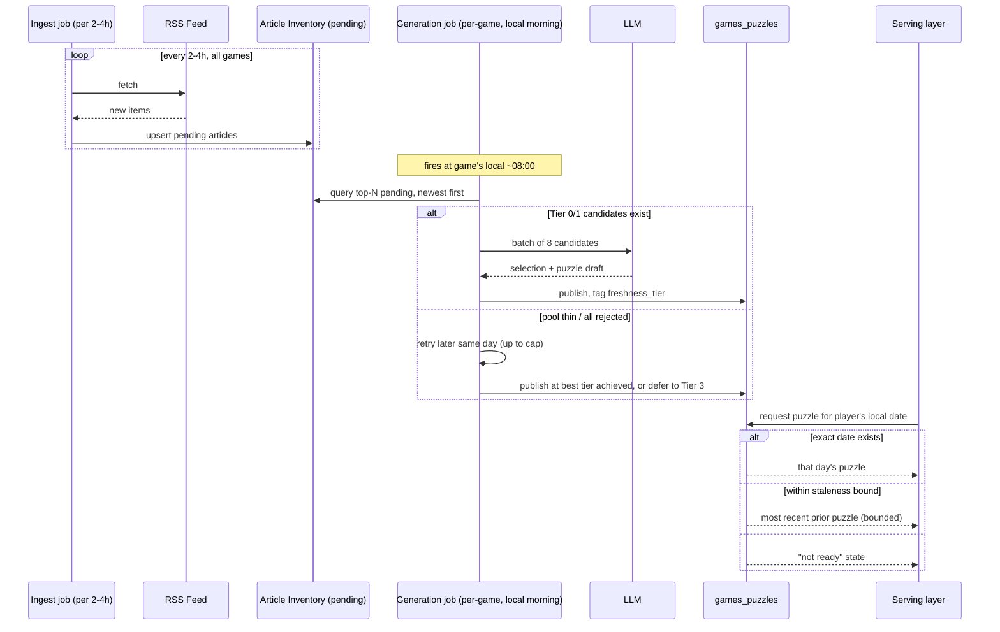
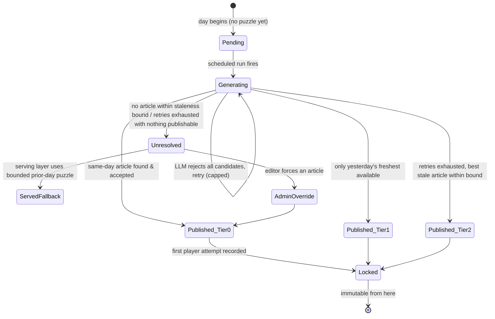

# RealiTea Generation Redesign: Freshness-First Puzzle Selection

Status: **draft sketch for discussion, not a spec.** This document proposes no implementation itself — it does not commit to or describe any code change on its own.

Author's note: this is a from-first-principles rethink of *when and how RealiTea
picks the article a puzzle is based on*. It intentionally does not try to
preserve the shape of the current 7-day-ahead gap-fill buffer. Where the
current system is referenced, it's for contrast, not as a foundation.

---

## 1. Objective, precisely stated

Product intent, restated as an engineering target:

> For each game, the puzzle a player sees on calendar day D should be based on
> the freshest article available *as of the moment generation runs for day
> D*, generated as close to D as operationally practical — ideally same-day.

That needs to be made precise in three dimensions: **whose day**, **how
fresh**, and **what happens when fresh doesn't exist**.

### 1.1 Whose "day"

Each game has one primary local calendar, and "today" for generation purposes
is that calendar's day boundary — not a single global UTC cutover for all
five games. See §3.4 for why, and §4 for how this is scheduled.

### 1.2 Freshness target (the fallback ladder)

Define freshness as an ordered ladder evaluated at generation time for game
G's day D (D in G's local calendar):

1. **Tier 0 — same-day:** an eligible, unused article published on date D
   (G's local calendar). This is the target.
2. **Tier 1 — previous-day:** no Tier 0 article exists yet; use the freshest
   eligible article published on D-1. This is the *expected, not
   exceptional* case for early-morning generation runs (see §3.1) and is not
   a failure state.
3. **Tier 2 — freshest available, bounded:** no Tier 0/1 article; use the
   single freshest eligible pending article regardless of age, **provided**
   it is within a staleness bound (proposed default: 5 days — see §3.3 for
   where this number comes from). This is a degraded-but-acceptable state
   and should be visibly flagged (metric emitted, dashboard row, digest
   entry) but does not block publishing.
4. **Tier 3 — no eligible article within the staleness bound:** no fresh
   generation happens. The serving layer falls back to the most recent
   *previously published* puzzle for that game, bounded per §3.6, and an
   alert fires. This is the true failure state — a feed or the pipeline is
   broken and a human should look.

Each published puzzle row records which tier it was generated at
(`freshness_tier` + `source_article_published_at`), so "how fresh was today's
game, actually" is a queryable fact, not something inferred after the fact.

### 1.3 What "achievable" means going in

Tier 0 is not achievable 100% of the time, by the product owner's own
admission — a player who opens the game right after their local midnight will
see a Tier 1 (yesterday's freshest) puzzle unless a real Tier-0 article
already exists, because no amount of infrastructure conjures news that hasn't
been published yet. The goal is to make Tier 0 the common case (generation
running late enough in the local day that same-day news exists) and to make
Tier 1 the graceful, monitored fallback — not to eliminate Tier 1, which is
physically impossible.

---

## 2. Constraints and non-negotiables

These hold regardless of which architecture is chosen in §4:

1. **A puzzle with any player attempt is immutable.** Never regenerate,
   replace, or re-point a `games_puzzles` row that has one or more rows in
   `games_attempts`. This is already enforced today and must remain a hard
   invariant, checked at the DB layer (not just application logic) if
   possible.
2. **Every active game must have a servable puzzle every day**, even if its
   feed is dead, the LLM fails, or every candidate is rejected. "No puzzle
   today" is not an acceptable end state for a shipped game; "today's puzzle
   is Tier 2/3 and flagged" is.
3. **Generation cost is bounded, not infinite.** Moving from "once per 7-day
   window per game" to "once per day per game" is already up to a 7x
   increase in LLM calls (5 games × 1 run/day vs. 5 games × 1 run/day
   amortized over a 7-day buffer — see §4.5 for exact accounting). Any
   design that adds *retry* fan-out on top of that must keep a hard cap.
4. **An article, once selected and published, is not guaranteed to stay
   available for pull-back** — legal/factual takedown requests must be
   handled without violating constraint #1 (see §3.7).
5. **No player ever regresses**, i.e., a player who has already loaded/started
   today's puzzle must keep seeing that exact puzzle for the rest of that
   day even if generation reruns later (this falls out of #1 once an attempt
   row exists, but also should hold pre-attempt within a single session —
   don't swap the puzzle under a page that's already rendered it).
6. **Stay in the batch/cron operational style.** Infra is scheduled GitHub
   Actions against Postgres, not a hot path. This proposal stays in that
   style (shorter/more frequent cron, not a request-time generation service)
   — see §4.6 for the one place a stronger real-time option was considered
   and rejected.

---

## 3. Edge cases, enumerated

Each is stated as a scenario, then a resolution. Resolutions reference the
architecture in §4.

### 3.1 Midnight / day-boundary: no articles published yet for "today"

**Scenario:** Generation for game G's day D runs shortly after D's local
midnight. Real-world news publishing is sparse right after midnight (most
outlets front-load stories in local morning/daytime), so Tier 0 often
genuinely doesn't exist yet at that instant.

**Resolution:** This is exactly what the fallback ladder (§1.2) is for. Don't
treat "nothing published today yet" as an error — treat sub-Tier-0 results as
expected at early-morning run times and fall to Tier 1 automatically. The
key design lever is **when in the local day generation runs** (§4.1): running
at local midnight guarantees hitting this case constantly; running later
(e.g., mid-morning local) lets same-day news accumulate first and pushes more
days into Tier 0. There's a real tradeoff between "run early so the puzzle is
ready before any player could plausibly ask for it" and "run late so more
same-day news exists" — see §4.1 for the proposed resolution (run near local
morning, not local midnight, plus a late top-up pass).

### 3.2 A feed is dead/quiet for that game that day (zero new articles)

**Scenario:** CBS Sports (or any feed) simply has no new items in the last
ingest window — a slow news day, not a broken feed.

**Resolution:** Ingest still runs (see §4.2, ingest becomes more frequent,
decoupled from generation); if it nets zero new articles for that game, the
generation step just has a smaller/possibly-empty candidate pool and falls
further down the freshness ladder naturally. No special-case code needed
beyond the ladder — this converges with §3.3.

### 3.3 A feed's freshest article is still stale (last real story 3+ days old)

**Scenario:** The freshest pending article for a game is, say, 3 days old.
Do we serve it, delay, or something else?

**Resolution:** Serve it, if it's within the Tier-2 staleness bound (proposed
5 days — see below), but flag it. Delaying the puzzle isn't really an
option under constraint #2 (something must be servable every day). Rejecting
it outright and falling to Tier 3 (repeat old puzzle) is *worse* for a
slow-news game like CBS Sports than showing a 3-day-old but real, correctly-
labeled puzzle. The 5-day default is a starting proposal, not derived from
data — it should be a per-game config value (`gamesTopics.maxStalenessDays`
alongside the existing `articleExpiryDays`), because feed cadence differs
wildly by topic (see §3.8): TMZ/Page Six probably publish multiple times an
hour; CBS Sports on an off-day might go 2+ days between stories worth a
puzzle. **Open question for the product owner:** is a visibly-labeled 3-day-
old sports puzzle acceptable, or should sports have a materially longer
staleness bound than gossip by design rather than by accident?

### 3.4 Timezone: whose "today" counts?

**Scenario:** Players are in many timezones; a single global "today" cutover
either favors one region or fails everyone a little.

**Resolution:** Two things are already conceptually distinct in the current
system and should stay distinct: (a) the calendar day a puzzle is *labeled*
and generated for, and (b) the calendar day a given *player* perceives as
"today," used only to pick which already-published puzzle to serve them.

- (a) is anchored to **each game's own designated primary timezone**
  (proposed: keep America/Los_Angeles as default primary audience unless
  traffic data says otherwise per game — this can differ by game, e.g. a
  UK-leaning entertainment feed could reasonably use Europe/London). This is
  the timezone generation cadence is scheduled around (§4.1).
- (b) stays exactly as incident #12 already fixed it: a player's local date
  (from their tz cookie) resolves which dateKey to serve, and the
  most-recent-puzzle fallback is bounded to `dateUtc <= player's local
  dateKey` so nobody ever gets tomorrow's puzzle early. This proposal does
  not change that fix; it reduces how often the fallback is *needed* by
  generating closer to serve time.

A player in Tokyo will, on any design, sometimes see a puzzle whose "day" is
labeled for a US-anchored calendar and was generated using US-morning news.
That's an acceptable, disclosed tradeoff of having one primary-audience
anchor per game rather than per-player generation (which would require N
puzzles per game per day — rejected, see §4.6).

### 3.5 Player plays very late at night / early morning — has the "day" rolled over for them before cron ran?

**Scenario:** It's 6am in the player's timezone, their local calendar date
has already ticked over, but the day's cron generation run (anchored to the
game's primary timezone, which might be hours behind) hasn't fired yet.

**Resolution:** This is the incident-#12 scenario generalized, and the fix
generalizes with it: the player can *never* be served a puzzle whose dateKey
is later than their own local date, regardless of what inventory happens to
exist. If their local date has rolled over but generation hasn't produced
that date's puzzle yet, they see yesterday's puzzle (their local yesterday)
as the active one — which, if it was itself a fresh, same-day-generated
puzzle, is a perfectly good experience, just not a "new" one yet for them.
There is no way to hand them a new puzzle before the news it's based on
exists; the honest answer is they get the previous day's puzzle a little
longer. This should be true by construction from the existing bounded-
fallback logic, not a new special case.

### 3.6 Generation/LLM failure or rejection on the day of — no 7-day buffer to retry against

**Scenario:** Under same-day generation, a failed run or an LLM that rejects
every candidate has no slack — the old system could just let gap-fill catch
it on a later run because there were 7 days of headroom. Same-day generation
removes that headroom.

**Resolution:** Replace time-buffer-as-retry-mechanism with an explicit
same-day retry policy:

- Generation is a short-lived job that can be **retried intraday** with a
  capped number of attempts (proposed: 3 tries across the day, spaced hours
  apart — not immediate back-to-back retries, since immediate retries against
  the same stale candidate pool are unlikely to fix an LLM rejecting every
  candidate; spacing lets a fresh ingest pass feed in new candidates).
- Each retry re-pulls the current top-N pending articles (not a fixed
  snapshot from the first attempt), so a later retry benefits from
  freshness the first attempt didn't have.
- If all attempts across the day exhaust, the game falls to serving-time
  Tier 3 fallback (§1.2, §3.a bounded stale-serve) and fires an alert. A
  human can force a manual generation (§3.9) at that point.
- The **bounded serving-time fallback replaces the unbounded one** described
  as a known gap in the current system: fallback serves the most recent
  prior puzzle only if it's within a bound (proposed: 3 days) of "today";
  beyond that the UI should show an explicit "today's puzzle isn't ready
  yet" state rather than silently serving week-old content as if it were
  current. This is a product/UX decision as much as a backend one — flagged
  as an open question in §5.

### 3.7 An article needs to be pulled after the puzzle is already generated/served

**Scenario:** Factual error, takedown notice, or legal issue surfaces after
a puzzle referencing that article has already gone live (and possibly been
played).

**Resolution:** Split by whether the puzzle has player attempts yet
(constraint #1 is absolute):

- **No attempts yet:** treat as an admin override (§3.9) — replace the
  puzzle's source article and regenerate in place. This already has to
  exist as a capability (`replace` is already an admin action kind in the
  schema) and doesn't change under this proposal.
- **Has attempts:** the puzzle itself cannot change. This becomes a content-
  moderation action, not a generation action: unpublish/unlist the puzzle
  going forward (stop new players from starting it) while leaving existing
  attempts intact, and separately mark the source article `rejected` so it
  can never be selected again. The *day* effectively has no valid puzzle for
  new players until an editor decides whether to backfill with a same-day
  replacement (if another eligible article exists) or accept the gap. This
  is inherently a human-in-the-loop moment; automating it further risks
  automating away the legal/factual judgment that triggered it.

### 3.8 Multiple games sharing infrastructure — same cadence for all?

**Scenario:** Sports news and gossip news do not arrive at the same rate.
Forcing every game onto identical generation timing either wastes runs on
slow feeds or generates too early for fast ones.

**Resolution:** Same-day-per-game, but **not identical clock time per
game** — see §4.1's per-game scheduling. Cadence (how many times/day
generation is attempted) can also differ per game via config, not code:
gossip feeds (TMZ, Page Six, Reality Blurb) plausibly only need one
well-timed run since they have abundant same-day supply; a slow feed like
CBS Sports might benefit from checking twice (once mid-morning, once late
afternoon local) to maximize the chance of catching that day's one real
story before generation locks in for the day. This is exposed as a per-game
`generationSchedule` rather than a single global cron in `games_topics`
(schema addition, not built here).

### 3.9 Admin/manual override — force a specific article

**Scenario:** An editor wants a specific article used regardless of what
automated selection would pick.

**Resolution:** This already exists conceptually (`hand_edited`,
`replace`, `publish` admin actions in the schema) and composes cleanly with
same-day generation: an override is just a generation run with
`sourceMode: "articles"` and an explicit article id, which bypasses the
ladder entirely. The only new consideration same-day generation introduces
is that an override made *after* automated same-day generation already ran
for that date should be allowed to supersede it (as today), but if attempts
already exist on the auto-generated puzzle, the override must go through
the §3.7 "has attempts" path (new-puzzle-going-forward, not in-place
mutation) rather than a silent replace.

### 3.10 Backfilling a gap after an outage

**Scenario:** Generation was broken for 2 days (bug, outage, API down).
Days D and D+1 have no puzzle. Should the backfill use "freshest available
now" or accept staleness?

**Resolution:** Backfill should **not** pretend it's still day D — that
manufactures false freshness. Two honest options, and the proposal is
to make this configurable per gap rather than picking one globally:

1. **Freshest-at-backfill-time for all gap days**, explicitly labeled as
   backfilled (`freshness_tier` + a `backfilled: true` flag) so it's
   queryable/auditable later, understanding the article picked for "day D"
   might actually be dated after D. This maximizes "the game was never
   visibly broken" but slightly muddies the freshness metric.
2. **Skip the gap days entirely** (no puzzle ever existed for D, D+1;
   history has a hole) if the product wants to preserve "every puzzle's
   date matches its article's date" as a strict invariant. Simpler
   guarantee, worse continuity.

Recommendation: (1), because constraint #2 (every game has *something*
every day) matters more for a live product than perfect historical
labeling, provided the backfilled flag makes the exception visible rather
than silently blending it into normal Tier-0 statistics.

---

## 4. Proposed architecture sketch

### 4.1 Cadence: per-game local-morning generation, not one global 7-day-ahead batch

Replace the single daily 17:00 UTC cron that pre-fills a 7-day rolling buffer
with:

- **Ingest** runs frequently and independently of generation — proposed
  every 2-4 hours, all games, cheap (no LLM cost, just RSS pulls +
  dedup/store). This maximizes how much same-day inventory exists by the
  time generation runs, without coupling ingest cadence to generation cadence.
- **Generation** runs once (or per-game-configured N times, §3.8) per game
  per day, timed to that game's **primary-timezone local morning**
  (proposed default ~08:00 local, tunable per game) — late enough that a
  meaningful slice of that day's news already exists (addressing §3.1),
  early enough that it's ready well before typical daily active usage picks
  up.
- **Forward buffer shrinks to ~1 day, not 7.** The buffer's original job —
  smoothing over a bad night — is now handled by the intraday retry policy
  (§3.6) and the bounded stale-serve fallback (§1.2 Tier 2/3), not by
  pre-generating a week of content that's guaranteed to be stale by the time
  it airs. Keeping a 1-day-ahead spare (generated same-day, for tomorrow,
  *after* today's real run succeeds) is a cheap insurance policy against a
  same-day pipeline outage without reintroducing the staleness the whole
  redesign exists to fix — see the tradeoff note in §4.5.

### 4.2 Inventory model: mostly unchanged, with one shift

Keep the shared pending/used/rejected/expired pool per game — it's a sound
model and doesn't need to be rebuilt. Two changes:

- **Selection always prefers newest `publishedAt` first**, not "any pending
  candidate." Today's gap-fill effectively did this implicitly because it
  ran against whatever was in the pool 7 days early; under same-day
  generation, recency ordering has to be explicit and primary in the
  candidate query, since the pool may now contain a wider spread of ages
  (from the wider staleness tolerance in §1.2).
- **`articleExpiryDays` and the new per-game `maxStalenessDays` (§3.3)
  become two different knobs**, not one: expiry governs when an article is
  swept from the pool entirely (housekeeping); staleness governs whether
  it's fresh *enough to publish today* (freshness ladder). An article can
  be within its expiry window but still fail the staleness bound for Tier 2.

### 4.3 State machine for a single day's puzzle slot

### 4.4 Bounding the serving-time fallback

The current unbounded "serve most recent created puzzle" is replaced with an
explicit bound (proposed default 3 days, configurable per game): if no
puzzle exists for the requested date within that bound, the API returns a
distinct "not ready" response rather than silently serving old content as if
current. Whether the frontend shows an error state, a "check back soon"
message, or something else is a product decision (flagged in §5) — the
backend change is just making the gap observable instead of silently papered
over.

### 4.5 Cost/ops tradeoff, stated explicitly

Moving from "1 generation call per game per 7 days, amortized" to "1+
generation call per game per day" is roughly a **7x increase in LLM spend
and cron minutes** for generation, before counting intraday retries (§3.6,
capped at 3x) or per-game multi-check cadence (§3.8). This is the direct
cost of the freshness objective and should be sized against actual
OpenRouter spend before committing to defaults — flagged in §5. Ingest
frequency also goes up (daily → every 2-4h) but ingest has no LLM cost, so
that increase is comparatively cheap (more GitHub Actions minutes and RSS
fetches only).

### 4.6 Alternative considered and rejected: real-time/on-demand generation

A more aggressive design would generate a puzzle lazily on first request
each day, guaranteeing the absolute freshest possible article at read time.
Rejected for now because: it turns a batch pipeline into a request-time
dependency on an LLM call (latency, failure modes on the hot path, harder to
cap cost predictably), conflicts with constraint #6 (stay in the batch/cron
operational style unless there's a strong reason), and the marginal
freshness gain over "generate at local morning, ~8+ hours before typical
peak traffic" is small relative to the complexity it adds. Worth revisiting
only if per-game local-morning generation turns out to still miss Tier 0
often enough to matter.

---

## 5. Open questions for the product owner

1. **Staleness bound values.** Is 5 days an acceptable Tier-2 ceiling, and
   should it vary by game (sports vs. gossip) rather than being uniform?
   (§3.3, §3.8)
2. **Cost tolerance.** Is a ~7x increase in LLM generation calls (plus
   capped intraday retries) acceptable, or does the budget cap need to
   shape the design more (e.g., fewer per-game retries, single daily attempt
   with no top-up)? (§4.5)
3. **Bounded fallback UX.** When a puzzle genuinely isn't ready yet
   (Tier 3 / gap), what should the player actually see — an explicit
   "not ready" state, or is silently serving the nearest prior puzzle
   (bounded) still preferred over showing an error at all? (§3.6, §4.4)
4. **Per-game primary timezone.** Should every game stay anchored to
   America/Los_Angeles, or should some (e.g. a UK-leaning feed) use a
   different primary timezone for scheduling purposes? (§3.4)
5. **Backfill labeling.** Is it acceptable for backfilled puzzles to carry a
   visible "backfilled" flag distinct from normal freshness tiers, or should
   backfilled days be indistinguishable from normal days in the public-facing
   data? (§3.10)
6. **1-day forward buffer.** Is keeping a same-day-generated 1-day spare
   worth the added complexity, or is the intraday retry + bounded fallback
   enough safety net on its own? (§4.1)
7. **CBS Sports as the pathological case.** Given it's the most likely game
   to hit Tier 2/3 regularly, should it get materially different treatment
   (longer staleness bound, different generation cadence, or even a
   non-daily "puzzle of the week" model) rather than being forced into the
   same daily cadence as faster-moving feeds? (§3.3, §3.8)
